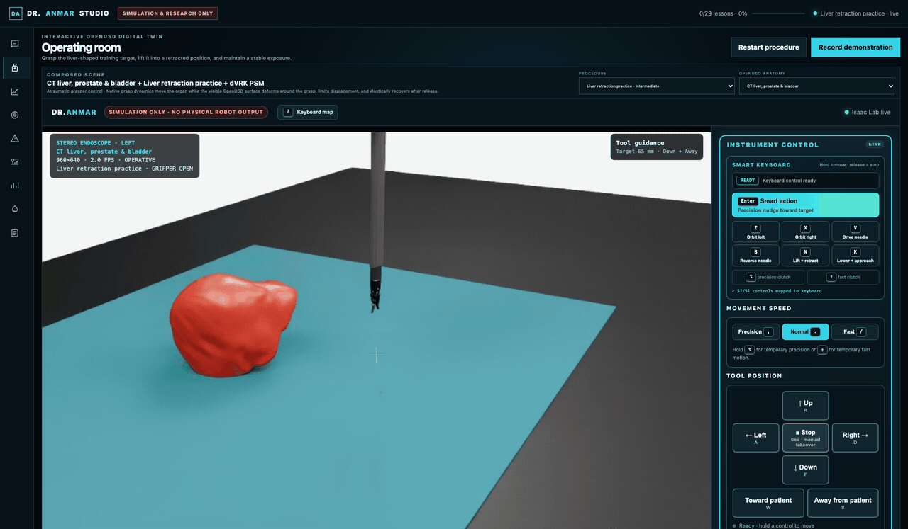
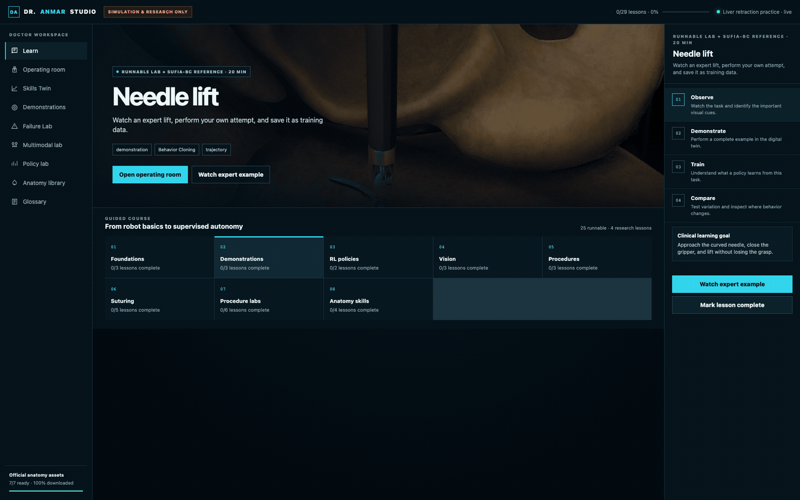
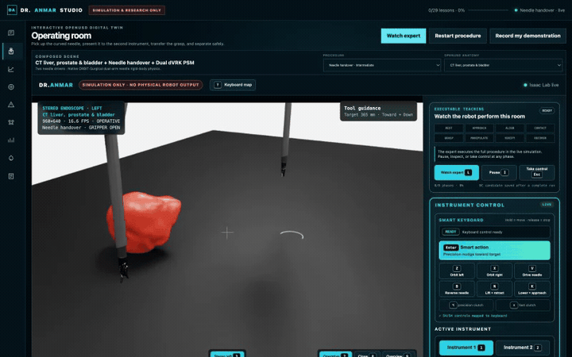
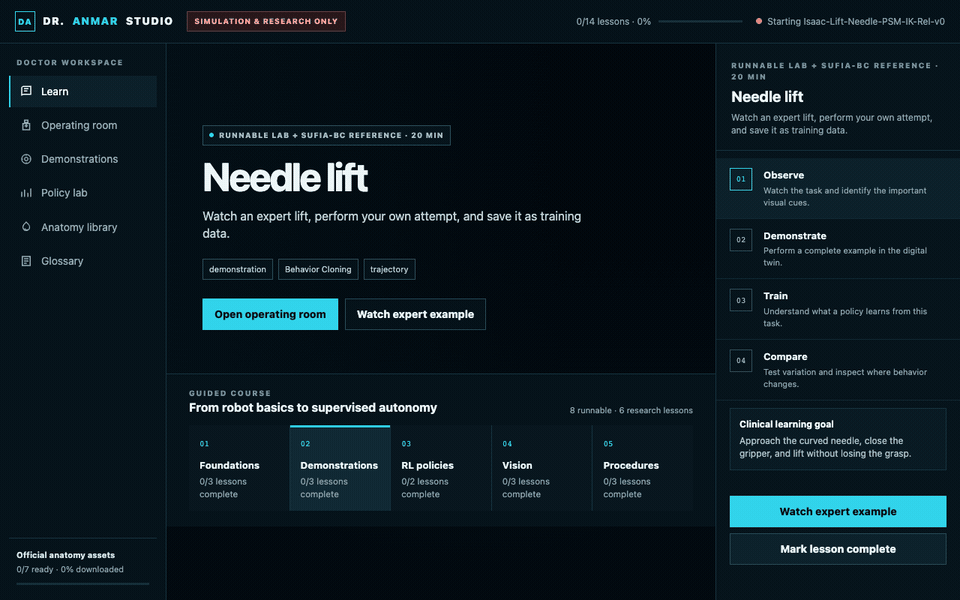
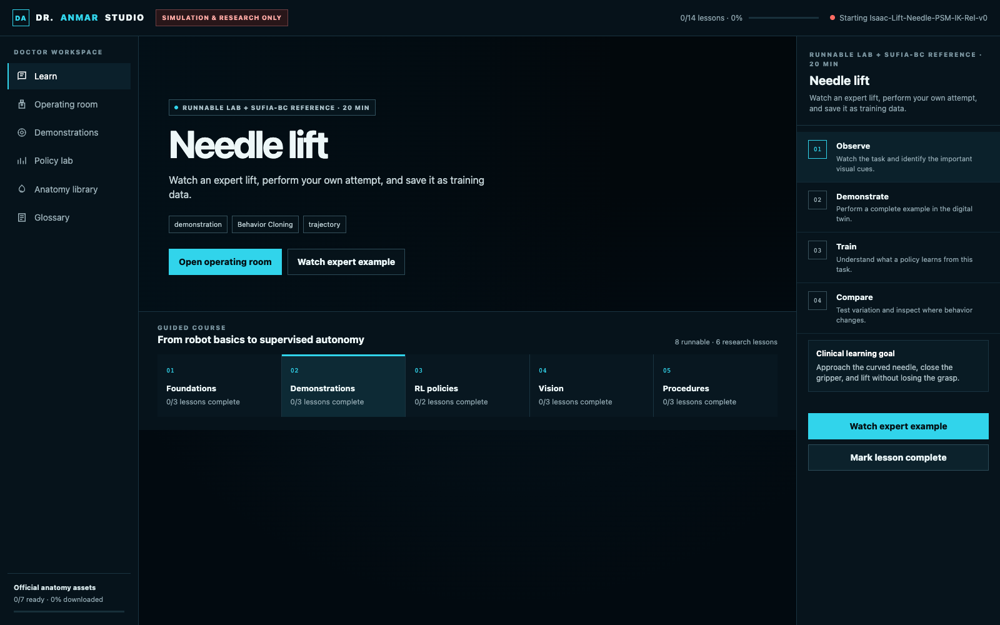
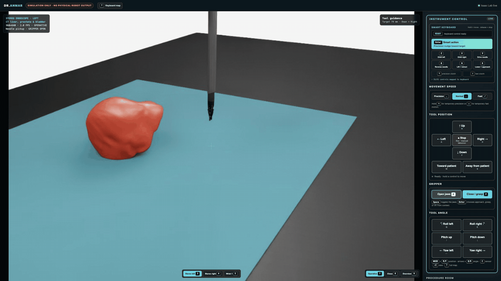
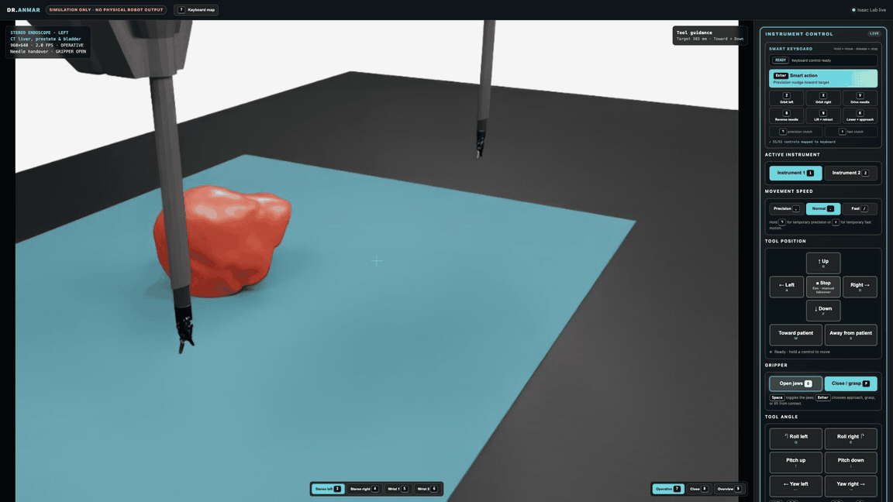
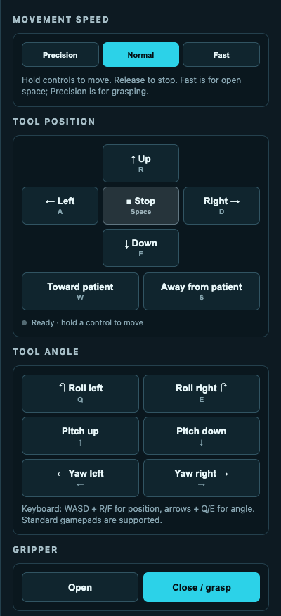
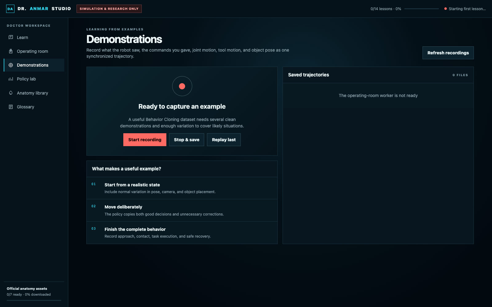

# Dr.Anmar

Dr.Anmar is a clinician-facing surgical robotics learning and research studio. It owns the doctor workflow,
procedure rooms, native interaction contracts, safety boundaries, expert guidance, evidence pipeline, and
research loop. The studio executes through Isaac Sim and PhysX, with ORBIT-Surgical-derived task foundations
and optional NVIDIA and SonoGym provider integrations behind explicit contracts. See
[`docs/OWNERSHIP.md`](docs/OWNERSHIP.md) for the full provenance boundary.

Researchers use the same workstation to compose OpenUSD anatomy, instruments and tasks; collect synchronized
multimodal trajectories; reproduce controlled failures; compare policies; and preserve dataset, experiment and
runtime provenance. External runtimes execute bounded simulation responsibilities; Dr.Anmar owns the connected
study and operating-room experience.

<p align="center">
  
</p>

<p align="center"><strong>A surgical robotics lab that begins with the doctor—not the simulator manual</strong><br>
Live native simulation control, training data, coaching, failure studies, and robot learning in one browser.</p>

Every visual below was captured from Dr.Anmar itself. No figures were copied from research papers.

> [!WARNING]
> Dr.Anmar is research software for simulation, synthetic data, and education. It is not a medical
> device, is not clinically validated, and must not be used for diagnosis, treatment, patient-specific
> planning, or control of physical surgical hardware.

## What Dr.Anmar offers

| Offering | What the doctor sees | What the researcher gets |
| --- | --- | --- |
| **Guided robotics curriculum** | 21 lessons that explain control, demonstration, vision, policies, procedures, safety, recovery and orthopedic ultrasound in clinical language | A reproducible progression from observation to teleoperation, data collection, training and comparison |
| **Interactive surgical digital twin** | Dr.Anmar rooms with game-like keyboard control, immediate stop/takeover, camera presets, task guidance and seven anatomy choices | Native task bindings, versioned OpenUSD composition, contact instrumentation and simulator telemetry |
| **Procedure rooms** | Needle handling, retraction, anatomy navigation, recovery, thread work and ultrasound tasks that connect to real simulator environments | A compact catalog with direct task, asset and external-provider bindings |
| **Demonstrations and Skills Twin** | Record a complete attempt, replay it, see phase-aware coaching, and compare against a clinician-selected reference | Checksummed trajectory/manifest pairs, task-native tool paths, multimodal observations, analysis and content-addressed dataset cards |
| **Failure Lab and policy evaluation** | Practise shifted viewpoints, low light, occlusion, target variation, calibration drift, tissue variation and safe hand-back | Seeded challenge matrices, interventions, native outcomes, safety events and immutable policy-evaluation cards |
| **Multimodal study builder** | Start from a clinical question and choose what the policy should perceive | Stereo RGB, depth, segmentation, point clouds, wrist cameras, pose, torque, contact, deformation, operator input and procedure annotations, with guarded NVIDIA workflow bindings |

<p align="center">
  
</p>

<p align="center"><strong>One connected workflow</strong><br>
Learn → operate → record → receive coaching → stress-test → build a study → train and compare.</p>

### Live surgical digital twin

The operating room composes a procedure, an anatomy preset, the correct robot task or provider, instrument
controls, safety boundary, camera views, teaching steps, and measurable completion signals. The doctor changes
rooms from a plain-language procedure menu; Dr.Anmar handles the worker lifecycle and restores the room after
bounded training or an external workflow.

<p align="center">
  
</p>

The main Operating Room is one stable NVIDIA surgical bench. Needle pickup, handover and passing are
progressive guided lessons inside that bench, while dropped-needle recovery is a repeatable physical scenario
on the same scene. Experimental tissue, anatomy and strand work lives in Research Labs. Orthopedic ultrasound
is one SonoGym workspace with navigation, reconstruction and guided-surgery modes.

### Executable expert guidance

Supported local procedure rooms can run a live expert controller through **Rest → Approach → Align → Contact → Grasp →
Manipulate → Verify → Recover**. This is not a prerecorded video: the robot acts inside the current OpenUSD
room while camera, task, force, tissue and phase telemetry update. A doctor can pause for inspection or take
manual control from the current phase. Complete runs are saved and qualified; only clean uninterrupted runs
become Behavior Cloning candidates, and clinician review is still required before reference promotion. The
full workflow and honest qualification boundary are documented in
[`docs/EXECUTABLE_EXPERT_GUIDANCE.md`](docs/EXECUTABLE_EXPERT_GUIDANCE.md).

<p align="center">
  
</p>

<p align="center"><strong>Dual-instrument needle handover</strong><br>
Pickup → presentation → receiving grasp → release → separation, performed in the live dual-PSM room.</p>

### Orthopedic robotic ultrasound with SonoGym

The Orthopedics course delegates three L4 research tasks to the pinned upstream SonoGym environments:

- robotic probe navigation to the transverse plane through the centre of L4;
- ultrasound-based L4 surface reconstruction with coverage observations; and
- dual-robot ultrasound-guided orthopedic trajectory research with SonoGym's safety cost.

Dr.Anmar owns the room and study flow, runs the provider headlessly on the GPU, and transports its native
ultrasound observation and action vector into the existing browser. SonoGym remains the provider for its
patient assets, ultrasound generation, task stepping, rewards, and safety constraints.

Install the public source, patient assets, ultrasound models and isolated runtime with:

```bash
./scripts/install_sonogym.sh
```

The installer pins SonoGym source commit `e67be58334d1a5274f0913af36f56e4b0b7ffe5a` and the public asset/model
dataset revision `b37b080a8673f856266a2306724e48d5e034521a`. Downloaded assets and the Isaac
runtime stay outside this Git repository. See [`docs/ORTHOPEDIC_ULTRASOUND.md`](docs/ORTHOPEDIC_ULTRASOUND.md).

## Control pedagogy designed for doctors

Dr.Anmar exposes robotics progressively instead of presenting a wall of simulator controls:

1. **Observe** — see the complete task and learn which visual cues matter.
2. **Demonstrate** — perform the same task in the digital twin and record the whole trajectory.
3. **Train** — connect the demonstration to Behavior Cloning or run a deliberately bounded RL exercise.
4. **Compare** — change anatomy, viewpoint, or object pose and inspect where behavior changes.

<p align="center">
  
</p>

<p align="center"><strong>Observe → Demonstrate → Train → Compare</strong><br>
One repeatable loop connects clinical intent, robot control, data collection, and policy evaluation.</p>



### Surgical controls that behave like a game

The live workstation translates six-degree-of-freedom robot control into a control surface clinicians can
learn immediately:

- Hold to move; release to stop.
- Precision, Normal, and Fast speed modes make fine grasping and open-space travel equally accessible.
- Position and angle controls use spatial language—*toward patient*, *away*, *roll*, *pitch*, and *yaw*.
- Every visible action has an audited keyboard equivalent. One Xbox-style controller is natively bimanual: the left
  and right sticks permanently own the left and right robots, with hold-to-use depth, wrist, camera and session layers,
  per-hand precision, explicit gripper controls, live mode feedback and supported-controller haptics.
- Push-to-talk voice and the matching typed-command fallback provide bounded robot nudges, explicit gripper actions,
  camera selection, speed changes, smart assist and emergency stop without creating an always-listening control path.
- `Enter` becomes a contextual approach → grasp → lift control, while six hold-to-move surgical combinations
  provide orbiting, curved needle driving, reversal, lift/retract, and lower/approach with one key each.
- A quick tap performs a bounded precision nudge; holding the same combination key gives continuous motion.
- Combined movement keys remain control conveniences only; they never create contacts, attachments, punctures
  or task success outside the native simulator.
- `Option` and `Shift` act as temporary precision and fast clutches; `Esc` always stops and restores manual control.
- Gripper and demonstration controls sit beside movement so practice naturally becomes training data.

The complete keyboard map and the rationale for each combined movement are documented in
[`docs/KEYBOARD_CONTROLS.md`](docs/KEYBOARD_CONTROLS.md).

<p align="center">
  
</p>

<p align="center"><strong>Archived keyboard workflow study</strong><br>
The control presentation remains useful; its former projected puncture sequence has been removed from the
runnable workstation.</p>

<p align="center">
  
</p>

<p align="center"><strong>Fast dual-instrument pickup and completed handoff</strong><br>
Pickup → presentation → dual grasp → holder release → receiver recovery → organ approach, with the active keyboard controls visible throughout.</p>

Robot articulation, rigid objects, jaw contact and object motion are governed by PhysX. Dr.Anmar observes that
state for teaching and recording but does not attach objects, disable anatomy collisions or project instrument
motion. Advanced tissue and device interactions return only through native deformable/topology/fluid workers.

<p align="center">
  
</p>

### Robot learning explained in clinical language

The Policy Lab compares Behavior Cloning, Reinforcement Learning, and Visual Behavior Cloning with simple
resident-training analogies. Training begins with a small, reviewable recipe so a new user learns what
observations, rewards, environments, iterations, logs, and checkpoints mean before scaling up.


The current RL truth boundary, NVIDIA-native PSM control/data contract, Gilgamesh qualification evidence, and
remaining lift/handover work are documented in [`docs/RL_FOUNDATION.md`](docs/RL_FOUNDATION.md), with the exact
qualification results in [`docs/PSM_FOUNDATION_VALIDATION_2026-07-23.md`](docs/PSM_FOUNDATION_VALIDATION_2026-07-23.md).

### Every practice attempt becomes structured training data

The Demonstrations workspace teaches what makes an example useful, records the complete behavior from
approach through safe recovery, and keeps synchronized observations, actions, joint motion, tool motion,
and object pose together for Behavior Cloning.



<p align="center">
  
</p>

The Skills Twin turns one saved attempt into an inspectable coaching record: tool path, object lift, grasp drift,
corrections, recovery hold, available contact and tissue signals, native simulator outcome, phase timeline and
reference comparison. Scores and cues are deliberately labeled as research proxies pending clinician validation.

### Multimodal studies without infrastructure-first UX

The Multimodal Lab starts with a medical research question, then explains each sensor or state channel by the
decision it helps a policy make. It generates a study manifest and binds selected modalities to the appropriate
Dr.Anmar or NVIDIA workflow while keeping privileged hardware modes locked until their prerequisites exist.

<p align="center">
  
</p>

## What is included

- Doctor Studio web interface with a live simulated endoscope and game-like PSM controls.
- OpenUSD operating rooms and seven pinned anatomy sources.
- Native rigid-body needle pickup, dual-arm handover, passing/regrasp, navigation and recovery rooms.
- PhysX contact sensors on the gripper bodies; no synthetic grasp joints or collision-disabling puncture paths.
- A compact 12-room procedure catalog backed by local tasks, installed thread assets, NVIDIA ultrasound,
  and SonoGym.
- Guided lessons, plain-language robotics explanations, progress tracking, and a robotics glossary.
- Demonstration recording and replay for behavior-cloning experiments.
- Executable eight-phase simulation experts in native-ready rooms, with live pause/resume, exact-state manual
  takeover, synchronized recording and degraded-run warnings.
- Surgical Skills Twin analysis with telemetry-derived coaching, phase timelines, subscores, and selected-attempt replay.
- Needle-lift Failure Lab with reproducible camera and visual challenges, supervision state, and immediate doctor handoff.
- Synchronized endoscopic RGB, robot state, native simulator outcomes, and available contact-force evidence in new demonstrations.
- Clinician-selected reference demonstrations with normalized trajectory comparison and coaching.
- Synchronized 50 Hz robot state plus 5 Hz endoscopic RGB, metric depth, semantic IDs, camera intrinsics,
  native task outcomes, available contact forces, and deformable-tissue research telemetry.
- Stereo endoscope views, task-native instrument wrist cameras, camera-frame metric point clouds, joint torque,
  anatomy pose, operator gaze/input provenance, and procedure phase/event annotation.
- A clinician-facing Multimodal Lab that converts a research question into an exportable study manifest bound
  to NVIDIA's robotic-surgery, robotic-ultrasound, SO-ARM/GR00T, and telesurgery workflows.
- A guarded NVIDIA workflow runner with live mode discovery, plain-language prerequisites, job logs,
  provenance manifests, automatic lesson restoration, and privileged hardware modes locked out by default.
- A pinned SonoGym provider with three native L4 orthopedic-ultrasound rooms, browser keyboard control,
  native observation streaming, isolated Isaac Lab 2.1.0 runtime, and source/asset provenance.
- Simulator-native target-pose, control-calibration, and multi-organ context challenges beside the camera and
  image stressors.
- Automated challenge summaries with per-scenario descriptive statistics, intervention rate, native success,
  safety-event rate, and 95% intervals where repeated rollouts exist.
- Content-addressed dataset cards that freeze demonstration and sidecar checksums, provenance, modalities,
  task context, references, duration, and intended research use into an exportable JSON record.

The multimodal architecture and study schema are described in
[`docs/MULTIMODAL_STUDIES.md`](docs/MULTIMODAL_STUDIES.md).
- Automated challenge matrices that replay one demonstration across selected scenarios and seeds while preserving every rollout.
- Versioned demonstration and experiment manifests recording task, scenario, seed, source revision, and training recipe.
- Nine registered task families and 54 control/play variants backed by the local simulator substrate.
- RSL-RL, RL-Games, Stable-Baselines3, SKRL, and Robomimic learning workflows.
- A resumable installer for seven pinned anatomy scene archives.
- An Isaac Sim 5.1 / Isaac Lab 2.3.2 compatibility layer for the local task environments.
- An isolated `physics-next` environment for PhysX FEM, coupled Newton VBD and CRESSim-MPM development.

Downloaded anatomy, demonstrations, checkpoints, logs, and runtime state are deliberately kept outside
the Git repository.

The first Skills Twin metrics are explicitly research coaching proxies rather than validated clinical
assessment instruments. Runtime, telemetry, performance, and clinician-study work intentionally deferred
from the fast implementation pass is tracked in [the validation backlog](docs/VALIDATION_BACKLOG.md).

## Requirements

The simulation runtime requires a compatible Linux x86-64 machine with an NVIDIA GPU. The Dr.Anmar
source folder can be inspected and managed on macOS or Windows, but Isaac Sim cannot run there as this
project's simulator backend.

The current validated baseline is:

- NVIDIA Isaac Sim 5.1
- Isaac Lab 2.3.2
- Python 3.10 or newer inside the Isaac environment

The optional research runtime is installed separately with `./dr_anmar_physics_next.sh install`. It targets
Isaac Sim 6.0.1 and Isaac Lab 3.0 beta2 and records the backend that actually generated each result. Its
versioned native-capability, asset, material and benchmark contracts live in
[`physics_next/`](physics_next/README.md), with measured evidence and unfinished calibration work in
[`docs/PHYSICS_NEXT_VALIDATION_LOG.md`](docs/PHYSICS_NEXT_VALIDATION_LOG.md).
The current Gilgamesh Newton VBD replay pair completed 600/600 finite steps at 17.074 ms p95, held global
tetrahedral-volume error to 4.787%, limited rigid-probe penetration to 0.0136 mm, measured a 1.019 N peak
normal reaction, produced no inverted elements, and reproduced the final state exactly. The canonical Newton
coupon met all five recorded engineering criteria. The authored 33,274-node / 165,031-tetrahedron patient
liver also loads and advances finitely through Newton with zero inversion in its separate integration smoke.
These remain non-clinical research results—not a promoted biomechanical patient model—because matched PhysX,
anatomical attachment, material calibration and clinician review are incomplete.

The July 20 Gilgamesh pass exercised the earlier prototype surface across its OpenUSD room compositions.
Those captures remain development history and are not evidence of native ultrasound, suturing, cutting or
tissue mechanics. Exact evidence is in
[`docs/GILGAMESH_VALIDATION_2026-07-20.md`](docs/GILGAMESH_VALIDATION_2026-07-20.md).
The historical coupled-physics and Isaac for Healthcare v0.6.0 pass is recorded in
[`docs/GILGAMESH_PHYSICS_I4H_V060_2026-07-20.md`](docs/GILGAMESH_PHYSICS_I4H_V060_2026-07-20.md).
The upstream-first v0.7.0 migration and its current qualification boundary are recorded in
[`docs/GILGAMESH_I4H_V070_MIGRATION_2026-07-23.md`](docs/GILGAMESH_I4H_V070_MIGRATION_2026-07-23.md).

Install Isaac Sim and Isaac Lab using their official instructions before continuing. NVIDIA components
are dependencies and are not redistributed by this repository.

## Quick start

Clone the repository outside the Isaac Lab checkout:

```bash
git clone https://github.com/Numi2/drAnmar.git
cd DrAnmar
cp .env.example .env
```

Edit `.env` so `ISAAC_PYTHON` points to the Python executable in your Isaac-enabled environment. Runtime
data defaults to `~/.local/share/dr-anmar` and can be moved by changing `DR_ANMAR_ROOT`.
For a shared workstation, set a long random `DR_ANMAR_ACCESS_TOKEN`; Doctor Studio then requires login and
shares the resulting secure session with its operating-room worker. Set `DR_ANMAR_COOKIE_SECURE=1` behind
HTTPS. `DR_ANMAR_SENSOR_PROFILE` selects `efficient`, `stereo`, or full `research` camera capture.

Install the ORBIT-Surgical extensions:

```bash
export IsaacLab_PATH=/absolute/path/to/IsaacLab
./orbitsurgical.sh
```

Start Doctor Studio:

```bash
./dr_anmar_suite.sh start
```

Optionally install the pinned Isaac for Healthcare v0.7.0 workflow source and compatible HoloHub CLI:

```bash
./scripts/install_i4h_workflows.sh
```

The installer creates a versioned checkout and points
`~/.local/share/dr-anmar/vendor/i4h-workflows-current` at it. Older checkouts remain available for rollback.
For NVIDIA's native surgical Arena environments, install the upstream runtime without the optional Cosmos
component:

```bash
export PATH="$HOME/.local/bin:$PATH"
./scripts/setup_i4h_agentic.sh
```

Install NVIDIA's matching v0.7.0 healthcare asset catalog and retrieve only the canonical surgical core:

```bash
./scripts/install_i4h_asset_catalog.sh
./scripts/fetch_i4h_assets.sh surgical-core
```

The catalog source is pinned to commit `b0b7ad39f26490d58d12407cfa74b3c9ad861769`; its v0.7.0
content address is `724f82e`. Assets are stored under `DR_ANMAR_ROOT`, never vendored into this repository.
The catalog supplies the canonical dVRK PSM/ECM, STAR, suture needle and SDF, suture pad, surgical
instruments, anatomy, ultrasound fixtures, medical robots and selected deformables. Downloads are split into
explicit `surgical-core`, `surgical-anatomy`, `ultrasound`, `medical-robots`, and `rheo` bundles.

Dr.Anmar does not rewrite the asset URLs inside NVIDIA's native Arena environments: the v0.7 Agentic source
currently pins those surgical environments to its v0.5 catalog content. The separate v0.7 catalog provider is
for provenance-safe new room composition until NVIDIA changes the upstream environment contract. Review the
licence shipped with every downloaded asset before redistribution. Lightwheel assets are restricted to
non-commercial research and development use. Installation, bundle sizes and the Gilgamesh evidence are in
[`docs/I4H_ASSET_CATALOG_V070.md`](docs/I4H_ASSET_CATALOG_V070.md).

Official workflow containers also require Docker Engine with NVIDIA GPU container support. DDS-based modes
such as robotic ultrasound require a valid `RTI_LICENSE_FILE`. The Multimodal Lab reports these prerequisites
and keeps launch disabled until they are present; the normal Dr.Anmar operating room does not require them.

Open [http://localhost:2360](http://localhost:2360). Useful service commands are:

```bash
./dr_anmar_suite.sh status
./dr_anmar_suite.sh logs
./dr_anmar_suite.sh restart
./dr_anmar_suite.sh stop
```

The hub and worker listen on all network interfaces by default so another trusted device can reach the
workstation. Optional token authentication and a single-operator browser lease are built in, but authentication
is disabled until `DR_ANMAR_ACCESS_TOKEN` is configured. Keep the service on a trusted LAN or private VPN,
enable the token for shared deployments, terminate HTTPS in front of it, and never expose ports 2360 or 2361
directly to the public internet. See [SECURITY.md](SECURITY.md).

## Anatomy scenes

The optional installer downloads the seven official ORBIT-Surgical v0.1.0 OpenUSD anatomy archives
(about 6.3 GB compressed) into `DR_ANMAR_ROOT`, never into the repository:

```bash
"${ISAAC_PYTHON}" scripts/install_sufia_assets.py
```

The Anatomy Library will detect the extracted scenes automatically. Review the upstream project and
release terms before redistributing any downloaded assets; this repository does not vendor them.

## Command-line workflows

```bash
# Inventory environments and educational content
./dr_anmar.sh list
./dr_anmar.sh catalog
./dr_anmar.sh doctor

# Run a bounded GPU smoke session
./dr_anmar.sh smoke Isaac-Lift-Needle-PSM-IK-Rel-v0 120

# Start a training workflow (example)
./dr_anmar_train.sh rsl_rl Isaac-Lift-Needle-PSM-IK-Rel-v0 --num_envs 256 --max_iterations 1000
```

The upstream teleoperation, state-machine, Robomimic, training, and policy-playback programs remain
under `source/standalone`.

## Repository layout

```text
web/                  Doctor Studio browser application
scripts/              Hub, workstation, curriculum, asset installer, and checks
source/extensions/    ORBIT-Surgical simulator extensions and robot assets
source/standalone/    Simulation, teleoperation, data, and learning workflows
docs/design/          Product design reference
dr_anmar_*.sh         Portable service and training launchers
```

## Open-source development

Run the public-release checks before opening a pull request:

```bash
python3 scripts/check_public_release.py
python3 scripts/audit_project_consistency.py
python3 scripts/audit_keyboard_controls.py
python3 scripts/check_web_syntax.py
python3 -m compileall -q scripts source
bash -n dr_anmar.sh dr_anmar_suite.sh dr_anmar_train.sh dr_anmar_workstation.sh orbitsurgical.sh
```

See the [complete engineering audit](docs/COMPLETE_AUDIT_2026-07-20.md),
[CONTRIBUTING.md](CONTRIBUTING.md) for contribution guidance, and [NOTICE.md](NOTICE.md) for provenance.

## ORBIT-Surgical citation

If this project contributes to published research, cite the ORBIT-Surgical authors:

```bibtex
@article{yu2024orbit,
  title={ORBIT-Surgical: An Open-Simulation Framework for Learning Surgical Augmented Dexterity},
  author={Yu, Qinxi and Moghani, Masoud and Dharmarajan, Karthik and Schorp, Vincent and Panitch, William Chung-Ho and Liu, Jingzhou and Hari, Kush and Huang, Huang and Mittal, Mayank and Goldberg, Ken and others},
  journal={arXiv preprint arXiv:2404.16027},
  year={2024}
}
```

## License

Dr.Anmar and the included ORBIT-Surgical-derived source are distributed under the
[BSD 3-Clause License](LICENSE). NVIDIA Isaac Sim and other optional dependencies or downloaded assets
retain their own licenses and terms.
