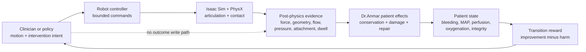
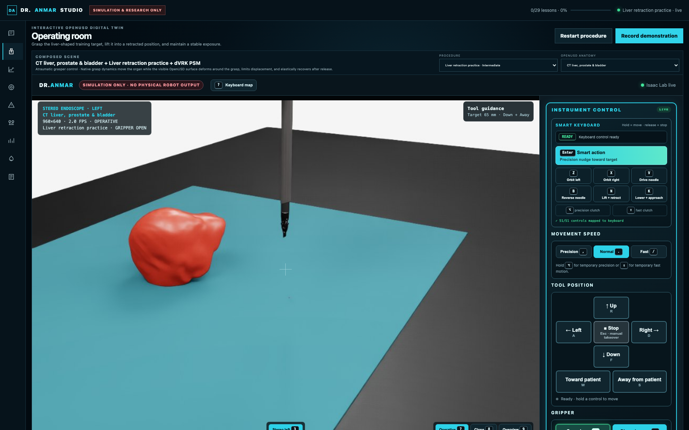
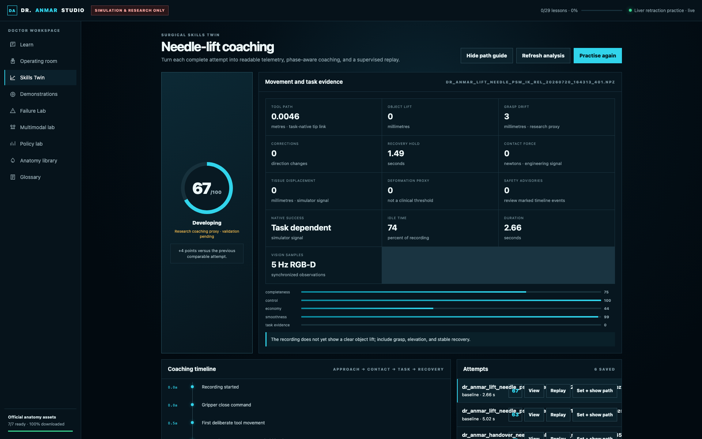
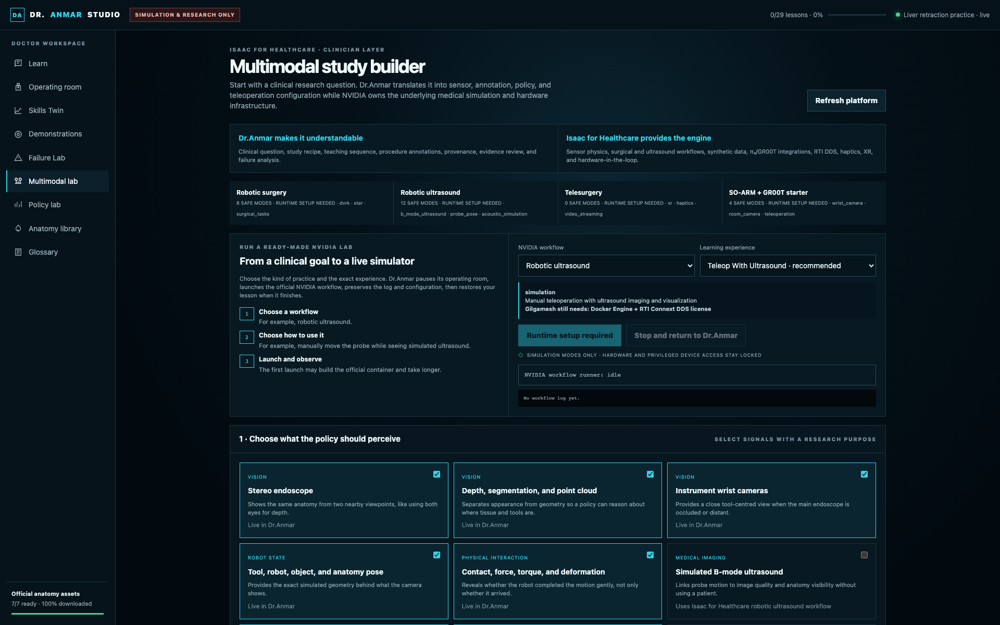
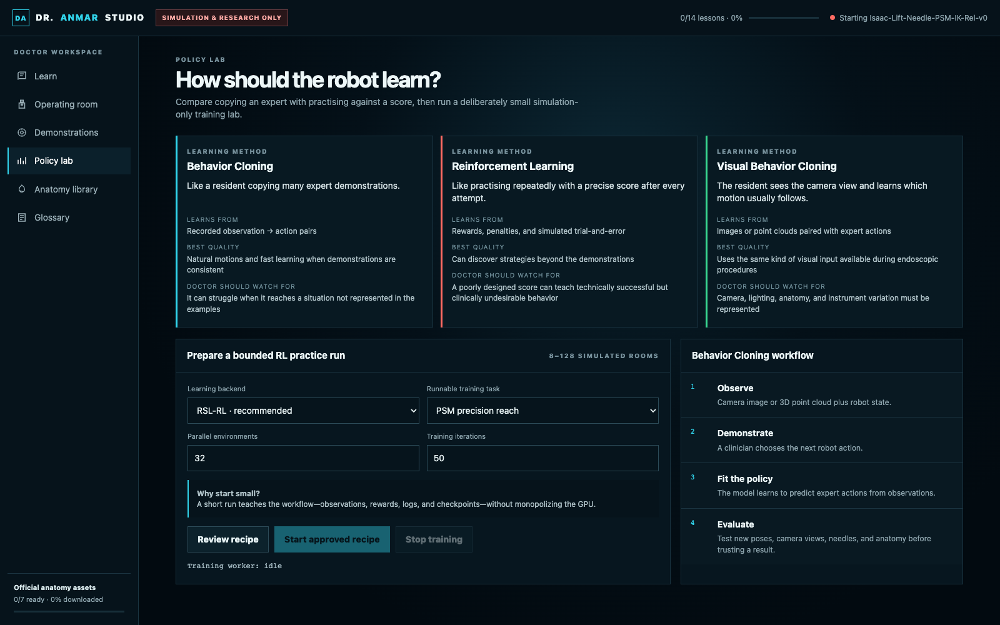
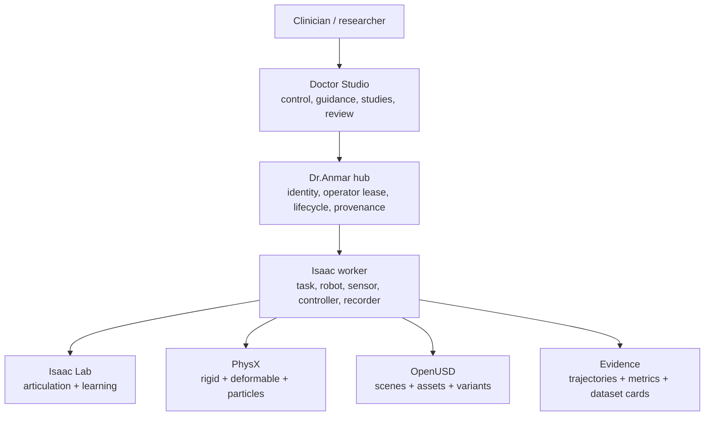

# Dr.Anmar

**Contact-driven surgical robotics for simulation, clinician demonstration,
robot learning, and patient-effect evaluation.**

[](docs/EVIDENCE_LEVELS.md)
[](https://developer.nvidia.com/isaac/sim)
[](https://isaac-sim.github.io/IsaacLab/)
[](https://openusd.org/)
[](https://github.com/Numi2/dr-assets)
[](LICENSE)

<p align="center">
  <a href="https://github.com/Numi2/dr-assets">
    
  </a>
</p>

<p align="center">
  <em>Autonomous Rescue OR — robot intervention, patient state, tools,
  resuscitation, and monitoring in one composable research scene.</em>
</p>

> A robot may command motion and intervention intent. It may not write the
> patient outcome.

Dr.Anmar owns the clinician-facing workflow, procedure rooms, robot-control
contracts, patient-effect architecture, demonstration pipeline, evaluation
surface, and evidence lifecycle. NVIDIA Isaac Sim, Isaac Lab, PhysX,
ORBIT-Surgical-derived foundations, and optional providers perform bounded
technical roles.

The result is a research platform in which robot behavior stays inspectable:
articulations and contacts advance in the simulator, post-physics evidence
drives patient effects, and learning algorithms receive reward only after the
environment computes the resulting benefit or harm.

> [!CAUTION]
> Dr.Anmar is research software for simulation, synthetic data, and evaluation.
> It is not clinically validated, is not a medical device, and must not control
> physical surgical hardware or be used for patient care.

## Robotics first

| Robot layer | Dr.Anmar responsibility |
| --- | --- |
| **Control** | Bounded Cartesian or joint commands, instrument selection, gripper state, immediate stop, operator takeover, and command provenance |
| **Simulation** | Articulations, rigid and deformable contact, attachments, particles, sensors, tool state, and procedure geometry |
| **Patient effects** | Bleeding, perfusion, repair integrity, fluid balance, ventilation, oxygenation, tissue damage, and physiological response |
| **Learning** | Causally aligned observations and actions, complete-episode datasets, policy loading, seeded rollout evaluation, and failure analysis |

The browser never declares contact, repair, division, perfusion, or success.
Those remain environment-owned outputs.

## Current robotic systems

Dr.Anmar currently integrates seven procedure-focused robot systems plus the
multi-arm OncoSurgery training cell. Each system ships with a standalone
mechanism, a composable robot payload, OpenUSD assets, interaction frames,
controller/task contracts, and a named evidence boundary.

| System | Robotic capability | Research surface |
| --- | --- | --- |
| [Wound preparation](docs/VALIDATION.md) | Contact-guarded debridement, irrigation, aspiration, interchangeable cartridges | Contact work, debris release, fluid accounting |
| [Atraumatic exposure](docs/atraumatic_exposure_robot/VALIDATION.md) | Bilateral distributed soft-tissue capture, lift, pitch, hold, and release | Force symmetry, visibility, capture retention |
| [Adaptive hemostasis](docs/adaptive_hemostasis_robot/VALIDATION.md) | Compression, irrigation, suction, clip delivery, patching, pressure verification | Flow reduction, retained repair, overload damage |
| [Adaptive anastomosis](docs/adaptive_anastomosis_robot/VALIDATION.md) | Alignment, approximation, eversion, stapling, reinforcement, leak and patency assessment | Closure geometry, retention, pressure decay |
| [Adaptive seal and divide](docs/adaptive_seal_divide_robot/VALIDATION.md) | Centering, compression, sealing, guarded division, irrigation and suction | Seal state, energy observables, blade interlock |
| [SafePlane dissection](docs/safeplane_dissection_robot/VALIDATION.md) | Distributed traction, blunt spreading, hydrodissection, guarded scissors and spatula | Protected-structure clearance and continuity |
| [Perfusion viability](docs/perfusion_viability_robot/VALIDATION.md) | Registered RGB, NIR/ICG, speckle, thermal, oxygenation, Doppler and ultrasound sensing | Multimodal fusion, fault diagnosis, abstention |
| [OncoSurgery cell](docs/SURGICAL_ONCOLOGY.md) | Three-station resection, margin sensing, specimen handling and cavity verification | Resection topology, protected structures, margin state |

### Procedure-scale systems

| Oncologic resection | SafePlane dissection |
| --- | --- |
| [](https://github.com/Numi2/dr-assets/tree/main/data/Props/SurgicalOncology/OncoSurgeryCell) | [](https://github.com/Numi2/dr-assets/tree/main/data/Props/SurgicalDissection/SafePlaneDissectionRobot) |
| Three coordinated stations for sensing, resection, margin assessment, and specimen handling. | Interchangeable traction, hydro, blunt, scissors, energy, and sensing components. |

| Adaptive hemostasis | Adaptive anastomosis |
| --- | --- |
| [](https://github.com/Numi2/dr-assets/tree/main/data/Props/SurgicalHemostasis/AdaptiveHemostasisRobot) | [](https://github.com/Numi2/dr-assets/tree/main/data/Props/SurgicalReconstruction/AdaptiveAnastomosisRobot) |
| Compression, clip, patch, suction, irrigation, and verification modes. | Alignment, approximation, staple formation, reinforcement, leak test, and patency. |

| Perfusion viability | Dynamic abdominal patient |
| --- | --- |
| [](https://github.com/Numi2/dr-assets/tree/main/data/Props/SurgicalAssessment/PerfusionViabilityRobot) | [](https://github.com/Numi2/dr-assets/tree/main/data/Props/Patients/DynamicAbdominalPatient) |
| Registered multimodal sensing with explicit validity and abstention behavior. | Layered abdominal access, organs, pathology, respiration, wound margins, and physiology. |

Robotic motion media belongs beside the exact replay that produced it. The
front page therefore uses revision-stable system and mechanism views; procedure
video should come from complete replays that visibly include approach, contact,
patient effect, release, and recovery rather than phase labels alone.

## Contact-owned patient effects

The learning environment owns the transition from intervention to outcome.
Temporary effects require current evidence; retained repairs require persistent
attachment and integrity.

| Uncontrolled vessel | Temporary compression | Retained repair |
| --- | --- | --- |
|  |  |  |
| Flow and blood loss remain active. | Benefit expires when bilateral contact disappears. | Benefit persists only while repair attachment and integrity remain valid. |



Examples of mutually supported evidence:

| Intervention | Environment-owned evidence | Failure remains visible |
| --- | --- | --- |
| Compress or clip | Bilateral force, symmetry, separation, placement, speed, retained attachment | Release, migration, overload, distal perfusion loss |
| Patch or anastomose | Distributed contact, closure gap, integrity, pressure hold, leaked particles | Delamination, residual leak, stenosis, rupture |
| Infuse | Plunger travel, outlet flow, reservoir loss, access attachment, line pressure | Disconnection, occlusion, overpressure, extravasation |
| Ventilate | Airway attachment, valve travel, delivered/leaked flow, pressure, oxygen fraction, chest excursion | Leak, unsafe pressure, inadequate delivery |

The complete mechanics and learning contracts live in the canonical
[Dr.Anmar asset catalog](https://github.com/Numi2/dr-assets).

## Executable Autonomous Rescue learning loop

Autonomous Rescue OR connects clinician demonstration to policy evaluation
without giving the policy patient-outcome controls:

```text
record complete expert episode
        ↓
pack causally aligned observations and actions
        ↓
train behavior cloning policy
        ↓
load immutable checkpoint into the live room
        ↓
run seeded patient-effect rollouts
        ↓
compare benefit, harm, release, and failure
```

```bash
./dr_anmar_rescue_il.sh policy-room /path/to/model_epoch_200.pth 2361
./dr_anmar_rescue_il.sh rollout 2361
./dr_anmar_rescue_il.sh evaluate-policy 2361 20 --continue-on-error
```

Robot, contact, vessel, vital-sign, fluid-balance, and causal camera signals
are observations. Patient-effect fields are excluded from the policy action
space, and train/validation masks are assigned at complete-episode boundaries.

## DrAnmar Learning Path

The reinforcement-learning path starts with measurable PSM pose control and
promotes policies through dual-tool coordination, contact-qualified lift, and
physical handover. The current handover incumbent is a frozen 98-observation,
14-action actor composed with a fixed pickup correction and a learned receiver
candidate-value head. It uses stable `DrAnmar-*` task IDs, GPU-native scene
cloning, seeded evaluation, live RAM/VRAM fitting, and typed benchmark evidence.

```bash
./dr_anmar_learning.sh validate
./dr_anmar_learning.sh smoke
./dr_anmar_learning.sh sweep
./dr_anmar_learning.sh tqta-start
./dr_anmar_learning.sh train
./dr_anmar_learning.sh tqta-report
./dr_anmar_learning.sh promoted-handover 1200 2000
```

See the complete [DrAnmar Learning Path](docs/DRANMAR_LEARNING_PATH.md) for task
stages, efficiency controls, promotion gates, and evidence boundaries.
The adopted
[robotic-surgery RL technical direction](docs/ROBOTIC_SURGERY_RL_TECHNICAL_DIRECTION.md)
minimizes **time to qualified task achievement**: wall-clock time from a frozen
task contract to the first checkpoint that passes held-out competence, safety,
and recovery gates.

### Current handover learning frontier

The promoted handover actor and the new custody-risk model solve different
problems and are meant to compose, not replace one another:

| Artifact | Output | Current evidence-backed status |
| --- | --- | --- |
| [Promoted handover actor](docs/handover_recovery_80/promoted_policy.lock.json) | Robot motion | **1,292 / 1,800** development successes (**71.78%**). This is the owner-promoted simulation incumbent; the original 80% development goal was explicitly overridden and no qualification claim is made. |
| One-decision receiver residual | Bounded motion correction | Not promoted. Its best held-out result was **+3 / 3,600** in aggregate while one seed regressed by 12; a fresh-stream update also lost to the incumbent on development seeds. |
| Calibrated active-custody risk model | Failure probability | Preserved as the leading risk model. Across three left-out physics seeds, AUC was **0.704–0.776** and nested cross-fitted Brier score improved to **0.07455** from a **0.08063** base-rate reference. |
| Counterfactual receiver trajectory | Bounded receiver XYZ scaling | Not promoted. Exact no-op replay passed, but uniform scale `0.6` reduced the activated cohort from **93 to 87** successes and added **4** receiver safety failures on the first prespecified seed. |
| Phase-conditioned full-action successor | Complete 14-D dual-arm action | Candidate infrastructure is now on `main`; no policy is promoted yet. Training remains locked until at least eight accepted single-environment teacher rescues cover all five phases and four development seeds. |

The actor still moves the robot. The risk model observes the one-frame
active-custody transition and estimates whether retention is likely to fail; it
does not emit actions and has no release or motion authority.

The causal trajectory screen is complete. Separate same-index Isaac processes
reproduced prebranch tensors and no-op terminal outcomes exactly, while
neighboring vectorized PhysX clones did not remain isolated after an
intervention. The only surviving speed candidate was negative, so no
behavior-cloning or PPO update was started from it and the promoted actor
remains unchanged.

The next learning stage is executable through
[`dr_anmar_handover_successor.py`](scripts/dr_anmar_handover_successor.py).
The risk model only allocates independent single-environment collection.
Better actions must come from constrained trajectory optimization or clinician
teleoperation, then beat two bit-identical no-op controls without any safety
event. Accepted complete episodes train one compact phase-conditioned network
that emits the full 14-D action. Episode-level splitting prevents frame
leakage, qualification seeds are forbidden from training, and every checkpoint
is candidate-only until live seeded evaluation promotes it.

```text
lock optimizer proposal → record control/control/teacher → accept episode
→ train full-action successor → compare against the frozen incumbent
```

The hand-authored recovery composition remains only as a sealed regression
baseline; none of its recovery wrappers are present in the successor runtime.

The full source-bound learning record, including per-seed calibration and
checkpoint hashes, is in the
[receiver policy learning report on the experiment branch](https://github.com/Numi2/drAnmar/blob/experiment/handover-attempt-rl/docs/handover_recovery_80/attempt_policy_learning_report.json).

## Doctor Studio

Doctor Studio is the clinician-facing workspace for live simulation,
teleoperation, demonstration recording, guidance, policy comparison, and
failure analysis.

| Live operating room | Skills Twin |
| --- | --- |
|  |  |
| Robot control, cameras, guidance, immediate stop, recording, and room state. | Phase timing, trajectory inspection, replay comparison, and clinician-selected references. |

| Multimodal study lab | Policy lab |
| --- | --- |
|  |  |
| RGB, depth, segmentation, point clouds, wrist cameras, pose, torque, contact, and annotations. | Seeded evaluation, perturbation, failure review, and bounded policy comparison. |

Control and data contracts:

- [Keyboard and controller interaction](docs/KEYBOARD_CONTROLS.md)
- [Camera-native hand teleoperation](docs/WEBCAM_TELEOPERATION.md)
- [Multimodal studies](docs/MULTIMODAL_STUDIES.md)
- [Executable expert guidance](docs/EXECUTABLE_EXPERT_GUIDANCE.md)

## Platform architecture



Downloaded assets, checkpoints, demonstrations, logs, and runtime state remain
outside Git. The repository contains the code, contracts, authored assets,
documentation, and revision-bound evidence references needed to reproduce a
study.

## Evidence boundary

Dr.Anmar keeps five claims separate:

| Level | Establishes | Does not establish |
| --- | --- | --- |
| Product capability | A workflow is integrated and available | Numerical fidelity |
| Repository verification | Source, schemas, manifests, paths, and contracts are internally consistent | Native engine behavior |
| Native-simulator evidence | A named revision ran on a recorded simulator, stack, and GPU | Real-world transfer |
| Real-world evidence | Instrumented hardware or bench data support a specific correlation | Clinical effectiveness |
| Clinical evidence | A defined clinical study supports a specific claim | Claims outside that study |

Current parameters are engineering parameters unless a robot-specific artifact
records instrumented calibration. Evidence does not transfer automatically
between workcells, revisions, representations, simulator versions, GPUs, or
physics configurations.

Start with:

- [Current release readiness](docs/CURRENT_RELEASE_READINESS.md)
- [Revision-bound portfolio evidence](physics_next/benchmarks/dranmar-portfolio-evidence-index.json)
- [Evidence levels](docs/EVIDENCE_LEVELS.md)
- [Validation backlog](docs/VALIDATION_BACKLOG.md)

## Quick start

The asset catalog is a pinned submodule, so clone recursively:

```bash
git clone --recurse-submodules https://github.com/Numi2/drAnmar.git
cd drAnmar
cp .env.example .env
```

Set `ISAAC_PYTHON` in `.env` to the selected Isaac environment, then install
the local extensions and start Doctor Studio:

```bash
export IsaacLab_PATH=/absolute/path/to/IsaacLab
./orbitsurgical.sh
./dr_anmar_suite.sh start
```

Open [http://localhost:2360](http://localhost:2360).

```bash
./dr_anmar_suite.sh status
./dr_anmar_suite.sh logs
./dr_anmar_suite.sh restart
./dr_anmar_suite.sh stop
```

The simulator backend requires Linux x86-64 and a compatible NVIDIA GPU. The
browser, source, and documentation can be inspected on macOS and Windows.
Recorded native-simulator lanes include Isaac Sim 5.1 / Isaac Lab 2.3.2 and
Isaac Sim 6.0.1.0. The current isolated lane is defined by
`config/physics-next-lock.json`, including full source revisions and exact
Torch packages; use the exact stack named by the evidence artifact you are
reproducing.

See [SECURITY.md](SECURITY.md) before exposing Doctor Studio beyond a trusted
LAN or private VPN.

## Repository map

```text
web/                    Doctor Studio browser application
scripts/                Hub, workers, control adapters, generators
examples/               Native CUDA evidence programs
source/extensions/      Simulator tasks and robot integrations
source/standalone/      Teleoperation, data, training, policy workflows
source/extensions/orbit.surgical.assets/
                        Pinned canonical dr-assets repository
physics_next/           Next-generation mechanics and evidence contracts
docs/                   Architecture, mechanisms, operation, evidence
dr_anmar_*.sh           Service, runtime, asset, and training launchers
```

## Research navigation

- [Ownership and provenance](docs/OWNERSHIP.md)
- [Architecture](docs/ARCHITECTURE.md)
- [Asset catalog](docs/ASSET_CATALOG.md)
- [Native suture mechanics](docs/DR_ANMAR_SUTURE_4_0.md)
- [Warp suture research backend](docs/DR_ANMAR_WARP_SUTURE.md)
- [Dynamic-patient boundary](docs/DYNAMIC_PATIENT_VALIDATION_BOUNDARY.md)
- [Multimodal study contract](docs/MULTIMODAL_STUDIES.md)
- [Contributing](CONTRIBUTING.md)

## Ownership, attribution, and license

Dr.Anmar owns the product workflow, procedure rooms, robot integrations,
patient-effect architecture, learning interface, and evidence lifecycle in this
repository. The compatibility namespace and identified task/robot foundations
retain their ORBIT-Surgical-derived BSD-3-Clause attribution. NVIDIA Isaac Sim,
Isaac Lab, PhysX, Isaac for Healthcare, and optional providers retain their own
licenses and are not bundled unless explicitly documented.

Dr.Anmar is distributed under the [BSD 3-Clause License](LICENSE). Publications
should report the Dr.Anmar revision, pinned `dr-assets` revision, simulator and
Isaac Lab versions, GPU/driver, scenario and seed, control policy, sensor
profile, and applicable evidence artifact.
