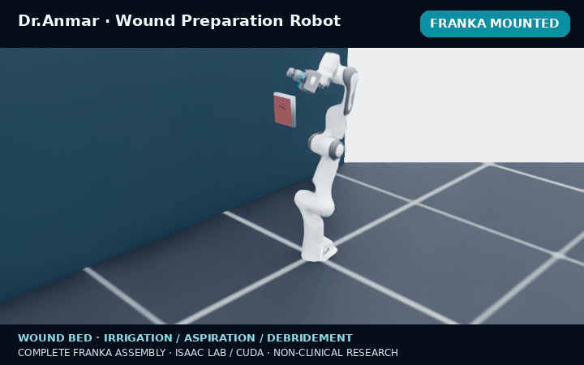
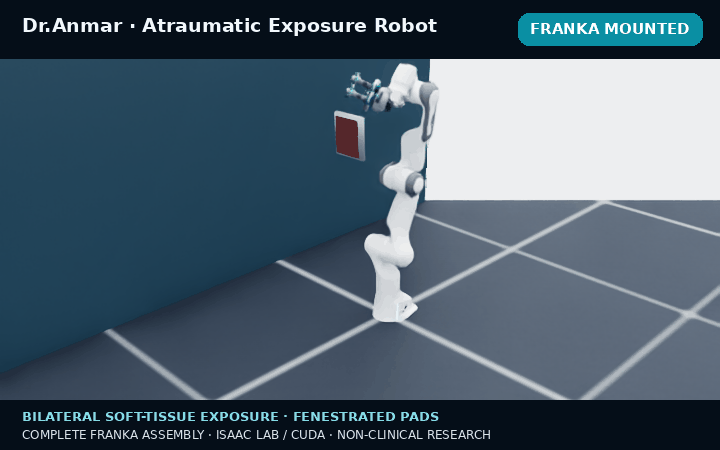
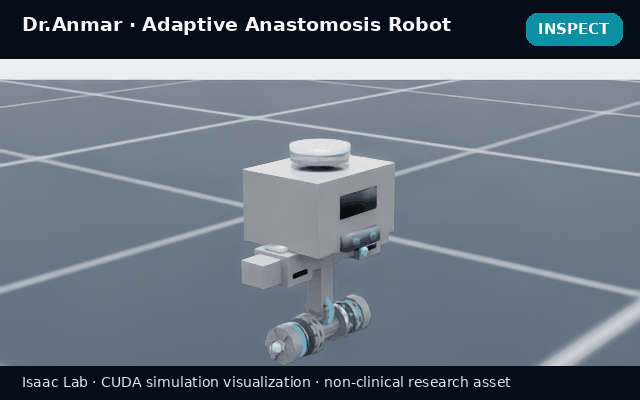
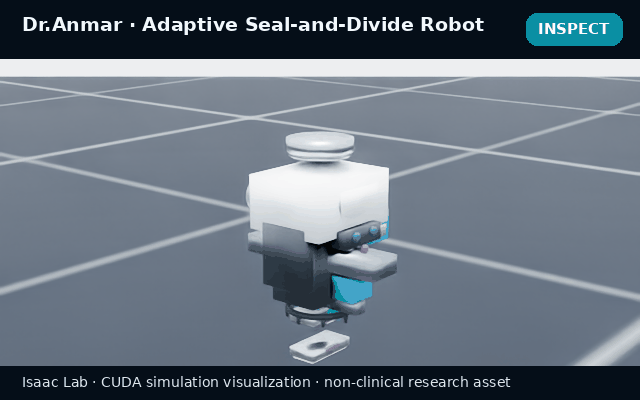
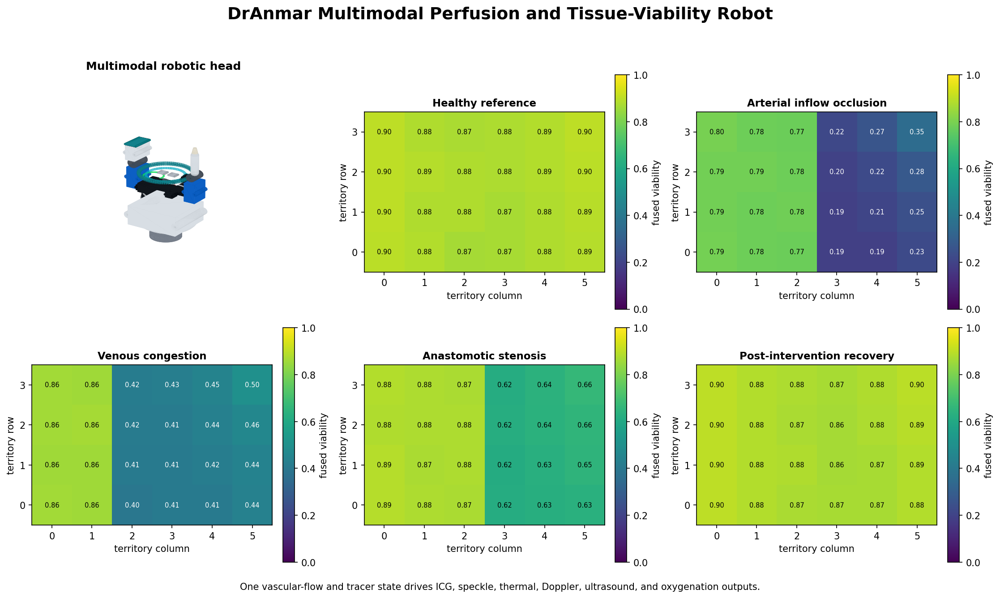

# Dr.Anmar

**A clinician-centered research platform for surgical robotics simulation, teleoperation, data collection, and policy evaluation.**

Dr.Anmar integrates interactive surgical workspaces, articulated robot systems, OpenUSD assets, PhysX mechanics,
multimodal sensing, demonstration recording, and reproducible experiment contracts. The platform is designed to
connect a clinician's procedural intent to inspectable robot behavior without hiding the underlying simulator,
control, data, or validation boundaries.

Dr.Anmar owns the doctor-facing workflow, procedure rooms, interaction contracts, safety controls, evidence
pipeline, and study lifecycle. NVIDIA Isaac Sim, Isaac Lab, PhysX, ORBIT-Surgical-derived task foundations, and
optional providers execute bounded technical roles. The complete ownership and provenance model is documented in
[`docs/OWNERSHIP.md`](docs/OWNERSHIP.md).

> [!CAUTION]
> Dr.Anmar is research software for simulation, synthetic data, and education. It is not a medical device, has not
> been clinically validated, and must not be used for diagnosis, treatment, patient-specific planning, or control of
> physical surgical hardware.

<p align="center">
  
</p>

## Research scope

Dr.Anmar supports four connected activities:

1. **Simulation:** compose articulated instruments, anatomy, sensors, contacts, deformables, particles, and
   task-specific mechanics in versioned OpenUSD scenes.
2. **Human demonstration:** control one or two instruments by keyboard, game controller, voice, or camera-native
   hand tracking while preserving audited command and simulator state.
3. **Robot learning:** record synchronized observations and actions, construct dataset cards, train bounded
   imitation- or reinforcement-learning experiments, and compare policies under controlled perturbations.
4. **Evaluation:** reproduce task phases and failures, measure native simulator outcomes, retain provenance, and
   distinguish software qualification from physical, biomechanical, clinical, and regulatory validation.

The platform is intended for reproducible engineering studies. Every quantitative result must be interpreted
within the exact asset revision, software stack, hardware, scenario, and measurement contract that produced it.

## Asset catalog and reproducibility

Dr.Anmar uses one provider-aware asset registry for repository assets and the
pinned NVIDIA Isaac for Healthcare v0.7.0 catalog. It inventories complete
asset directories, validates relative USD dependency closure, rejects path
traversal and workstation-absolute references, checks manifests and licensing
evidence, and can generate deterministic directory hashes for release locks.
The hub, workstation, native-room resolver, installers, and capability API use
the same provider-relative paths instead of maintaining independent root logic.

```bash
python3 scripts/dr_anmar_asset_registry.py verify
python3 scripts/dr_anmar_asset_registry.py inventory --hash
```

The clinician-facing capability payload is generated from all 19 entries in
`physics_next/dr-anmar-assets.json`, including every declared profile, runtime,
report, qualification, and composition artifact. This structural readiness is
not a substitute for native physics, physical, biomechanical, or clinical
qualification. See [`docs/ASSET_CATALOG.md`](docs/ASSET_CATALOG.md).

## New Dr.Anmar robot systems

Seven procedure-specific systems were added and qualified on 25 July 2026. Each system is provided as:

- a standalone articulated mechanism for isolated development;
- a composable payload mounted to an Isaac Lab Franka articulation;
- deterministic source generation and asset manifests;
- OpenUSD, GLB, texture, interaction-frame, controller, and task contracts;
- CPU-side structural and controller tests; and
- a headless CUDA runtime qualification program.

The animations below were rendered directly from the complete Franka-mounted OpenUSD assemblies in Isaac Lab on
an NVIDIA RTX 4090. Each clip opens on the full robot, then moves to the authored tool center point and procedure
fixture while the mechanism executes its phase targets. They are simulation visualizations, not
physical-performance or clinical evidence.

### Wound preparation robot

<p align="center">
  
</p>

An articulated concentric work head combines a compliant contact guard, interchangeable debridement cartridge,
multi-nozzle irrigation, annular aspiration, and explicit fluid-volume accounting. The simulation model represents
adhered debris release through accumulated contact work and conserves emitted, active, aspirated, spilled, and
discarded particle volume.

The qualified CUDA snapshot covered both standalone and Franka-mounted representations for 120 steps, all five
tool joints, a cooked surface-deformable wound, seven debris attachments, 80 PBD particles, zero fluid-ledger
balance error, finite joint state, and zero error-level engine messages. See
[`docs/VALIDATION.md`](docs/VALIDATION.md).

### Atraumatic exposure robot

<p align="center">
  
</p>

The exposure system uses symmetric carriages, independent lift and pitch axes, compliant pad travel, and twelve
distributed capture cells. Fenestrated and microcup pad variants share one articulation and force/visibility
control contract, enabling controlled comparison of contact geometry without changing the experimental interface.

Both pad geometries passed the standalone and Franka-mounted 120-step CUDA matrix with finite articulation state,
two cooked tissue flaps, two outer anchors, twelve capture constraints, finite controller output, and zero
error-level engine messages. See
[`docs/atraumatic_exposure_robot/VALIDATION.md`](docs/atraumatic_exposure_robot/VALIDATION.md).

### Adaptive hemostasis robot

<p align="center">
  
</p>

This system combines bilateral compression, irrigation and annular suction, clip delivery, patch application, and
a reduced-order pressure/flow verification model. Its runtime contract separates temporary compression,
retained-clip, and patch-bond attachments so that control phases and failure conditions remain independently
inspectable.

Qualification checks current surface-deformable vessel schemas, all eleven tool joints, attachment lifecycles,
conserved particle-volume bookkeeping, suction capture, provisional retention/cure thresholds, pressure-challenge
integration, finite state, and error-free engine execution in standalone and Franka-mounted configurations. See
[`docs/adaptive_hemostasis_robot/VALIDATION.md`](docs/adaptive_hemostasis_robot/VALIDATION.md).

### Adaptive anastomosis robot

<p align="center">
  
</p>

The anastomosis system provides bilateral circumferential capture, coaxial tissue approximation, an expandable
lumen mandrel, independent eversion, a sixteen-position staple crown, reinforcement-collar application, temporary
occlusion, and a pressure-decay test model.

The native runtime matrix covers the 14-DoF standalone mechanism and 21-DoF Franka assembly, two cooked tissue
surfaces, twelve temporary capture attachments, sixteen retained staples through 32 leg attachments, 32 cured
collar-sector attachments, conserved PBD leak particles, patency evaluation, an eight-second pressure-decay
challenge, at least 120 CUDA steps, and finite state. See
[`docs/adaptive_anastomosis_robot/VALIDATION.md`](docs/adaptive_anastomosis_robot/VALIDATION.md).

### Adaptive seal-and-divide robot

<p align="center">
  
</p>

The seal-and-divide system integrates tissue centering, symmetric jaw compression, guarded blade travel,
irrigation, suction, energy-state estimation, thermal and impedance observables, seal verification, and explicit
blade-before-seal interlocks.

CUDA qualification requires two cooked vessel surfaces, two distal fixtures, sixteen bridge attachments, four
temporary compression attachments, four retained seal-band attachments, interlocked division, release of temporary
constraints, exact joint counts, finite state for 120 steps, and zero engine errors in both standalone and
Franka-mounted representations. See
[`docs/adaptive_seal_divide_robot/VALIDATION.md`](docs/adaptive_seal_divide_robot/VALIDATION.md).

### SafePlane dissection robot

The SafePlane system combines bilateral distributed traction with blunt
spreading, seven-port hydrodissection, guarded articulated micro-scissors, and
a retractable low-energy spatula. Independent vessel, nerve, and duct assets
retain explicit continuity and modality-specific clearance interlocks; an
override produces inspectable simulated injury state rather than bypassing the
physical model.

Its CUDA matrix covers the 17-DoF standalone mechanism and 24-DoF Franka
assembly, two cooked tissue surfaces, target-bed fixtures, traction and bridge
attachments, all 28 releasable adhesion bridges, protected-structure
continuity, conserved PBD fluid, finite state for 120 steps, and zero engine
errors. See
[`docs/safeplane_dissection_robot/VALIDATION.md`](docs/safeplane_dissection_robot/VALIDATION.md).

### Perfusion and tissue-viability robot

<p align="center">
  
</p>

The perfusion system registers stereo RGB, NIR/ICG, laser speckle, thermal,
surface oxygenation, depth, Doppler, and ultrasound sensing around one TCP.
Its estimator is blind to scenario labels and latent flow state, fuses
temporal ICG evidence, removes failed modalities, tracks conserved contrast and
coupling gel, and explicitly abstains on invalid registration, timing,
coverage, or confidence.

The v0.1.1 CUDA matrix covers both the 12-DoF standalone mechanism and 19-DoF
Franka assembly for 260 steps, six nonconstant rendered camera streams, finite
depth, a cooked tissue surface with two fixtures, blind diagnosis of six
modeled faults, force-coupled probe contact, evidence-based intervention, and
three loaded-arm poses with the authored 2.537 kg payload. See
[`docs/perfusion_viability_robot/VALIDATION.md`](docs/perfusion_viability_robot/VALIDATION.md).

### Surgical-oncology research cell

The OncoSurgery Cell integrates a payload-backed 22-joint tumor-resection tool,
a 3,028-cell liver tumor field, 96 explicit resection bonds, protected vascular
and bile-duct interlocks, registered RGB/depth, NIR, hyperspectral, ultrasound,
OCT, and Raman contracts, specimen containment and orientation, cavity
verification, and corrective resection.

Its Isaac Lab runtime provides standalone, rigid-proxy, Franka-mounted, liver,
specimen, and three-station workcell factories; bounded reset-time domain
randomization; a 12-term policy observation; dense safety-aware reward; and a
contract-gated final margin report. The imported USDA layers were repaired and
wrapped with lightweight relative-payload interfaces, and the Franka payload
representations now share a consistent authored 2.5534 kg mass. The native
tissue route couples the task to the Dynamic Patient liver's explicit
tetrahedral PhysX GPU volume deformable while retaining the registered
resection graph for irreversible topology changes. Native CUDA qualification
now records a passing RTX 4090 non-contact volume-stability lane with 274 live
tetrahedral nodes, bounded displacement and speed, and zero engine errors.
Robot-tissue contact, rendered sensors, Franka payload behavior, and all
physical, biomechanical, and clinical validation remain explicit promotion
gates. See
[`docs/SURGICAL_ONCOLOGY.md`](docs/SURGICAL_ONCOLOGY.md).

## Platform architecture

```text
Clinician / researcher
        │
        ▼
Doctor Studio ── control, guidance, study configuration, review
        │
        ▼
Dr.Anmar hub ── authentication, operator lease, lifecycle, provenance
        │
        ▼
Isaac worker ── task, robot, sensor, controller, recorder bindings
        │
        ├── Isaac Lab articulation and task APIs
        ├── PhysX rigid, deformable, attachment, and particle mechanics
        ├── OpenUSD scenes, materials, assets, and variants
        └── optional bounded NVIDIA / SonoGym workflows
        │
        ▼
Evidence ── trajectories, manifests, metrics, logs, dataset cards
```

This separation is intentional:

- the browser never determines physical contact, attachment, puncture, division, or task success;
- visible controls are converted into bounded robot commands and audited;
- native simulator state is the authority for mechanics and outcomes;
- provider-specific behavior remains behind explicit adapters;
- downloaded assets, demonstrations, checkpoints, logs, and runtime state remain outside Git; and
- promotion claims are limited to the evidence recorded for the exact tested configuration.

## Doctor Studio

Doctor Studio presents the simulator as a procedural workspace rather than an infrastructure console. It includes:

- guided robotics lessons expressed in clinical language;
- live OpenUSD operating and research rooms;
- keyboard and game-controller bimanual control;
- camera-native one- or two-hand webcam teleoperation;
- bounded voice commands with a matching typed-command fallback;
- immediate stop, pause, takeover, and camera controls;
- demonstration recording, replay, and clinician-selected references;
- Skills Twin trajectory and phase analysis;
- seeded Failure Lab perturbations and policy evaluation; and
- multimodal study manifests for RGB, depth, segmentation, point clouds, wrist cameras, pose, torque, contact,
  deformation, operator input, and procedure annotations.

The interaction model and safety behavior are documented in
[`docs/KEYBOARD_CONTROLS.md`](docs/KEYBOARD_CONTROLS.md) and
[`docs/WEBCAM_TELEOPERATION.md`](docs/WEBCAM_TELEOPERATION.md). The multimodal data contract is described in
[`docs/MULTIMODAL_STUDIES.md`](docs/MULTIMODAL_STUDIES.md).

## Evidence and validation model

Dr.Anmar uses four distinct evidence levels:

| Level | Establishes | Does not establish |
| --- | --- | --- |
| Structural validation | Parseable assets, schemas, manifests, hashes, paths, and package consistency | Runtime stability or physical behavior |
| Controller tests | Deterministic phase logic, bounds, interlocks, accounting, and failure handling | Simulator integration or calibrated control |
| CUDA runtime qualification | Bounded execution on the recorded Isaac/GPU stack, finite state, expected schemas and constraints, and specified smoke-test outcomes | Generalization to another stack or physical system |
| Physical and clinical validation | Requires calibrated hardware, tissue models/specimens, metrology, safety analysis, clinician protocols, and regulatory governance | Not supplied by this repository |

Current robot qualification is limited to the first three levels. Mechanical constants, tissue parameters,
pressure/flow thresholds, energy models, contact limits, damage proxies, and success thresholds are provisional
research values unless a robot-specific document explicitly records calibrated evidence.

## Requirements

The simulator runtime requires a Linux x86-64 system with a compatible NVIDIA GPU. Source, documentation, and
browser code can be inspected on macOS or Windows, but this project's Isaac Sim backend does not execute there.

Validated lanes currently include:

- Isaac Sim 5.1 with Isaac Lab 2.3.2 for the stable operating-room workflow; and
- Isaac Sim 6.0.1.0 with Isaac Lab 6.1.16 for the new surface-deformable robot qualification lane.

Python 3.10 or newer is required inside the corresponding Isaac environment. NVIDIA components and optional
provider assets retain their own licenses and are not redistributed by this repository.

## Quick start

Clone the repository outside the Isaac Lab checkout:

```bash
git clone https://github.com/Numi2/drAnmar.git
cd drAnmar
cp .env.example .env
```

Set `ISAAC_PYTHON` in `.env` to the Python executable in the selected Isaac environment. Runtime data defaults to
`~/.local/share/dr-anmar`; change `DR_ANMAR_ROOT` to relocate it. For a shared workstation, configure a long random
`DR_ANMAR_ACCESS_TOKEN`, use `DR_ANMAR_COOKIE_SECURE=1` behind HTTPS, and keep the services on a trusted LAN or
private VPN.

Install the local extensions:

```bash
export IsaacLab_PATH=/absolute/path/to/IsaacLab
./orbitsurgical.sh
```

Start Doctor Studio:

```bash
./dr_anmar_suite.sh start
```

Open [http://localhost:2360](http://localhost:2360). Service controls are:

```bash
./dr_anmar_suite.sh status
./dr_anmar_suite.sh logs
./dr_anmar_suite.sh restart
./dr_anmar_suite.sh stop
```

See [`SECURITY.md`](SECURITY.md) before allowing access from another machine.

## Reproducing robot qualification

Run a robot's static validator and unit tests before its CUDA runtime test. For example:

```bash
python3 scripts/validate_dranmar_wound_preparation_robot.py --require-usdchecker
python3 -m unittest -v tests/test_wound_preparation_robot.py

./isaaclab.sh -p examples/validate_wound_preparation_runtime.py \
  --headless --device cuda:0 --representation standalone
./isaaclab.sh -p examples/validate_wound_preparation_runtime.py \
  --headless --device cuda:0 --representation franka
```

Equivalent validators and runtime programs are included for the exposure,
hemostasis, anastomosis, seal-and-divide, SafePlane dissection, and perfusion
viability systems. Do not transfer a passing result between robot revisions,
representations, simulator versions, GPUs, or physics configurations.

The Isaac Lab documentation GIFs can be regenerated with:

```bash
./isaaclab.sh -p scripts/capture_dranmar_robot_gif.py \
  --headless --enable_cameras --device cuda:0 \
  --robot adaptive-hemostasis \
  --output docs/screenshots/robots/adaptive-hemostasis-isaac-lab.gif
```

Valid robot identifiers are `wound-preparation`, `atraumatic-exposure`, `adaptive-hemostasis`,
`adaptive-anastomosis`, and `adaptive-seal-divide`.

## Command-line workflows

```bash
# Inspect registered environments and curriculum content
./dr_anmar.sh list
./dr_anmar.sh catalog
./dr_anmar.sh doctor

# Run a bounded task smoke session
./dr_anmar.sh smoke Isaac-Lift-Needle-PSM-IK-Rel-v0 120

# Start a training experiment
./dr_anmar_train.sh rsl_rl \
  Isaac-Lift-Needle-PSM-IK-Rel-v0 \
  --num_envs 256 \
  --max_iterations 1000
```

## Repository structure

```text
web/                  Doctor Studio browser application
scripts/              Hub, workers, control adapters, generators, and checks
examples/             Native CUDA qualification programs
tests/                Controller and package regression tests
source/extensions/    Simulator tasks and articulated robot assets
source/standalone/    Teleoperation, data, training, and policy workflows
physics_next/         Versioned next-generation physics contracts
docs/                 Architecture, mechanisms, evidence, and validation records
dr_anmar_*.sh         Portable service, runtime, and training launchers
```

## Development checks

Run the public-release checks before submitting changes:

```bash
python3 scripts/check_public_release.py
python3 scripts/audit_project_consistency.py
python3 scripts/audit_keyboard_controls.py
python3 scripts/check_web_syntax.py
python3 -m compileall -q scripts source
bash -n dr_anmar.sh dr_anmar_suite.sh dr_anmar_train.sh \
  dr_anmar_workstation.sh orbitsurgical.sh
```

See [`CONTRIBUTING.md`](CONTRIBUTING.md), [`NOTICE.md`](NOTICE.md), and the
[`validation backlog`](docs/VALIDATION_BACKLOG.md).

## Citation

If ORBIT-Surgical-derived components contribute to published research, cite:

```bibtex
@article{yu2024orbit,
  title={ORBIT-Surgical: An Open-Simulation Framework for Learning Surgical Augmented Dexterity},
  author={Yu, Qinxi and Moghani, Masoud and Dharmarajan, Karthik and Schorp, Vincent and
          Panitch, William Chung-Ho and Liu, Jingzhou and Hari, Kush and Huang, Huang and
          Mittal, Mayank and Goldberg, Ken and others},
  journal={arXiv preprint arXiv:2404.16027},
  year={2024}
}
```

Publications using Dr.Anmar should additionally report the repository revision, robot asset manifest, simulator
and Isaac Lab versions, GPU/driver, scenario and seed, control policy, sensor profile, and applicable qualification
report.

## License

Dr.Anmar and the included ORBIT-Surgical-derived source are distributed under the
[`BSD 3-Clause License`](LICENSE). Isaac Sim, Isaac Lab, NVIDIA assets, SonoGym, and other optional dependencies
retain their own licenses and terms.
