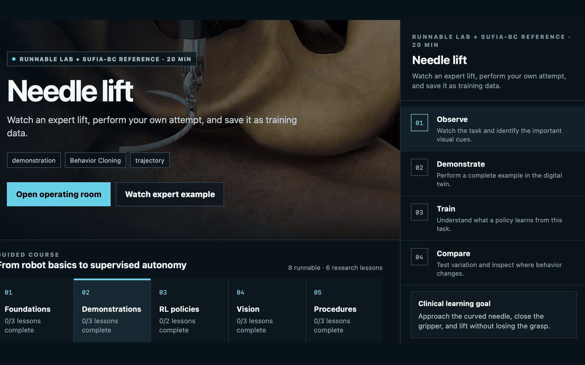

# Dr.Anmar

Dr.Anmar is a browser-first surgical robotics research and teaching environment built on
[ORBIT-Surgical](https://github.com/orbit-surgical/orbit-surgical), NVIDIA Isaac Sim, and Isaac Lab.
It turns the underlying simulator into a guided workstation where doctors and robotics researchers can
inspect anatomy, operate simulated instruments, record demonstrations, and explore imitation-learning
and reinforcement-learning workflows.

<p align="center">
  
</p>

<p align="center"><strong>From clinical lesson to live digital twin</strong><br>
Guided teaching, simulated robot control, anatomy variation, and policy learning in one doctor-facing workspace.</p>

All visuals below are project-owner-approved Dr.Anmar interface screens.

> [!WARNING]
> Dr.Anmar is research software for simulation, synthetic data, and education. It is not a medical
> device, is not clinically validated, and must not be used for diagnosis, treatment, patient-specific
> planning, or control of physical surgical hardware.

## Control pedagogy designed for doctors

Dr.Anmar exposes robotics progressively instead of presenting a wall of simulator controls:

1. **Observe** — see the complete task and learn which visual cues matter.
2. **Demonstrate** — perform the same task in the digital twin and record the whole trajectory.
3. **Train** — connect the demonstration to Behavior Cloning or run a deliberately bounded RL exercise.
4. **Compare** — change anatomy, viewpoint, or object pose and inspect where behavior changes.

<p align="center">
  
</p>

<p align="center"><strong>Observe → Demonstrate → Train → Compare</strong><br>
One repeatable loop connects clinical intent, robot control, data collection, and policy evaluation.</p>


### Surgical controls that behave like a game

The live workstation translates six-degree-of-freedom robot control into a control surface clinicians can
learn immediately:

- Hold to move; release to stop.
- Precision, Normal, and Fast speed modes make fine grasping and open-space travel equally accessible.
- Position and angle controls use spatial language—*toward patient*, *away*, *roll*, *pitch*, and *yaw*.
- Every action has a keyboard equivalent, with standard gamepad support for continuous input.
- Gripper and demonstration controls sit beside movement so practice naturally becomes training data.

<p align="center">
  
</p>

### Robot learning explained in clinical language

The Policy Lab compares Behavior Cloning, Reinforcement Learning, and Visual Behavior Cloning with simple
resident-training analogies. Training begins with a small, reviewable recipe so a new user learns what
observations, rewards, environments, iterations, logs, and checkpoints mean before scaling up.


### Every practice attempt becomes structured training data

The Demonstrations workspace teaches what makes an example useful, records the complete behavior from
approach through safe recovery, and keeps synchronized observations, actions, joint motion, tool motion,
and object pose together for Behavior Cloning.


## What is included

- Doctor Studio web interface with a live simulated endoscope and game-like PSM controls.
- A default operating-room showcase with the surgical robot, controls, room, and liver geometry.
- Guided lessons, plain-language robotics explanations, progress tracking, and a robotics glossary.
- Demonstration recording and replay for behavior-cloning experiments.
- Nine ORBIT-Surgical task families and 54 registered control/play variants.
- RSL-RL, RL-Games, Stable-Baselines3, SKRL, and Robomimic workflows inherited from ORBIT-Surgical.
- A resumable installer for seven official ORBIT-Surgical v0.1.0 anatomy scene archives.
- An Isaac Sim 5.1 / Isaac Lab 2.3.2 compatibility port of the upstream environments.

Downloaded anatomy, demonstrations, checkpoints, logs, and runtime state are deliberately kept outside
the Git repository.

## Requirements

The simulation runtime requires a compatible Linux x86-64 machine with an NVIDIA GPU. The Dr.Anmar
source folder can be inspected and managed on macOS or Windows, but Isaac Sim cannot run there as this
project's simulator backend.

The current validated baseline is:

- NVIDIA Isaac Sim 5.1
- Isaac Lab 2.3.2
- Python 3.10 or newer inside the Isaac environment

Install Isaac Sim and Isaac Lab using their official instructions before continuing. NVIDIA components
are dependencies and are not redistributed by this repository.

## Quick start

Clone the repository outside the Isaac Lab checkout:

```bash
git clone https://github.com/Numi2/drAnmar.git
cd DrAnmar
cp .env.example .env
```

Edit `.env` so `ISAAC_PYTHON` points to the Python executable in your Isaac-enabled environment. Runtime
data defaults to `~/.local/share/dr-anmar` and can be moved by changing `DR_ANMAR_ROOT`.

Install the ORBIT-Surgical extensions:

```bash
export IsaacLab_PATH=/absolute/path/to/IsaacLab
./orbitsurgical.sh
```

Start Doctor Studio:

```bash
./dr_anmar_suite.sh start
```

Open [http://localhost:2360](http://localhost:2360). Useful service commands are:

```bash
./dr_anmar_suite.sh status
./dr_anmar_suite.sh logs
./dr_anmar_suite.sh restart
./dr_anmar_suite.sh stop
```

The hub and worker listen on all network interfaces by default so another trusted device can reach the
workstation. There is no built-in authentication. Keep it on a trusted LAN or private VPN and never
expose ports 2360 or 2361 directly to the public internet. See [SECURITY.md](SECURITY.md).

## Anatomy scenes

The optional installer downloads the seven official ORBIT-Surgical v0.1.0 OpenUSD anatomy archives
(about 6.3 GB compressed) into `DR_ANMAR_ROOT`, never into the repository:

```bash
"${ISAAC_PYTHON}" scripts/install_sufia_assets.py
```

The Anatomy Library will detect the extracted scenes automatically. Review the upstream project and
release terms before redistributing any downloaded assets; this repository does not vendor them.

## Command-line workflows

```bash
# Inventory environments and educational content
./dr_anmar.sh list
./dr_anmar.sh catalog
./dr_anmar.sh doctor

# Run a bounded GPU smoke session
./dr_anmar.sh smoke Isaac-Lift-Needle-PSM-IK-Rel-v0 120

# Start a training workflow (example)
./dr_anmar_train.sh rsl_rl Isaac-Lift-Needle-PSM-v0 --num_envs 256 --max_iterations 1000
```

The upstream teleoperation, state-machine, Robomimic, training, and policy-playback programs remain
under `source/standalone`.

## Repository layout

```text
web/                  Doctor Studio browser application
scripts/              Hub, workstation, curriculum, asset installer, and checks
source/extensions/    ORBIT-Surgical simulator extensions and robot assets
source/standalone/    Simulation, teleoperation, data, and learning workflows
docs/design/          Product design reference
dr_anmar_*.sh         Portable service and training launchers
```

## Open-source development

Run the public-release checks before opening a pull request:

```bash
python3 scripts/check_public_release.py
python3 -m compileall -q scripts source
bash -n dr_anmar.sh dr_anmar_suite.sh dr_anmar_train.sh dr_anmar_workstation.sh orbitsurgical.sh
```

See [CONTRIBUTING.md](CONTRIBUTING.md) for contribution guidance and [NOTICE.md](NOTICE.md) for provenance.

## ORBIT-Surgical citation

If this project contributes to published research, cite the ORBIT-Surgical authors:

```bibtex
@article{yu2024orbit,
  title={ORBIT-Surgical: An Open-Simulation Framework for Learning Surgical Augmented Dexterity},
  author={Yu, Qinxi and Moghani, Masoud and Dharmarajan, Karthik and Schorp, Vincent and Panitch, William Chung-Ho and Liu, Jingzhou and Hari, Kush and Huang, Huang and Mittal, Mayank and Goldberg, Ken and others},
  journal={arXiv preprint arXiv:2404.16027},
  year={2024}
}
```

## License

Dr.Anmar and the included ORBIT-Surgical-derived source are distributed under the
[BSD 3-Clause License](LICENSE). NVIDIA Isaac Sim and other optional dependencies or downloaded assets
retain their own licenses and terms.
