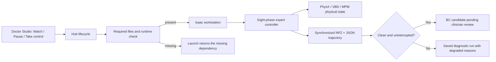

# Dr.Anmar architecture

## Purpose and safety boundary

Dr.Anmar is a simulation-only surgical training and research studio. It owns the browser workflow, room
contracts, controls, safety boundaries, expert guidance, and local evidence pipeline. The browser submits
bounded actions to a single Isaac Lab worker, receives simulated endoscopic frames, and stores demonstrations
locally. ORBIT-Surgical-derived tasks and external providers are implementation dependencies, not the product
boundary. No component contains a physical-robot driver or a clinical workflow integration.

## Runtime components

1. `dr_anmar_suite.sh` manages the hub and the one active GPU worker.
2. `scripts/dr_anmar_hub.py` serves Doctor Studio, curriculum data, anatomy inventory, and bounded
   training requests.
3. `scripts/dr_anmar_workstation.py` owns the active Isaac Lab environment and exposes simulated tool
   movement, camera frames, reset, and demonstration recording.
4. `scripts/dr_anmar_anatomy_viewer.py` provides a low-overhead static preview for an installed official
   anatomy scene without keeping an Isaac worker active.
5. `web/doctor_studio.html` presents the doctor-facing learning and operating-room interface.
6. `scripts/dr_anmar_physics_authority.py` reads the optional multi-solver manifest and reports runtime
   diagnostics for physics development.
7. `dr_anmar_physics_next.sh` manages a separate Isaac Sim 6 / Isaac Lab 3 environment under mutable runtime
   storage. It never replaces or stops the stable worker.
8. `scripts/dr_anmar_expert.py` runs the shared eight-phase expert state machine. The workstation maps each
   phase into room-specific actions, records the trajectory, and keeps degraded runs out of the reference set.

Only one GPU worker is active at a time. Switching a lesson or anatomy room replaces that worker rather
than accumulating Isaac Sim processes. Training, NVIDIA healthcare workflows, Failure Lab matrices and
interactive worker mutations are mutually exclusive. A temporary GPU job captures the exact procedure and
OpenUSD anatomy context, pauses the workstation, and restores that context afterward. Hub startup reconciles
stale in-progress manifests so a previous job cannot silently coexist with a new workstation.

## Storage model

The repository is immutable application source. Mutable data lives under `DR_ANMAR_ROOT`, which defaults
to `~/.local/share/dr-anmar`:

```text
assets/sufia_bc/       extracted optional anatomy scenes
downloads/sufia_bc/    resumable release archives
demos/                 recorded demonstrations and manifests
logs/                  hub, worker, smoke, and training logs
run/                   process IDs and asset-install status
state/                 local curriculum progress
training/              bounded training jobs and metadata
isaac_portable/        isolated Isaac caches and settings
```

These paths are ignored if a developer deliberately points `DR_ANMAR_ROOT` inside the repository.

## Expert execution and qualification



`completed` describes phase traversal, not task success. Reference qualification additionally requires no
bounded-convergence warnings, no intervention, complete recording, and later clinician review. The browser
GIFs and exact evidence are documented in [`EXECUTABLE_EXPERT_GUIDANCE.md`](EXECUTABLE_EXPERT_GUIDANCE.md).

## Network model

The hub defaults to port 2360 and the worker to port 2361. Both bind to
`127.0.0.1`. A non-loopback bind fails closed unless the operator explicitly
enables remote access, configures an access token, and confirms TLS termination
and firewall controls. Same-host Origin checks, one-operator mutation leases,
and conservative response headers provide defense in depth, but they do not
replace institutional identity, authorization, and network controls.

## Compatibility baseline

The local task substrate ports the ORBIT-Surgical Isaac Sim 4.1-era environment code to the installed Isaac
Sim 5.1 / Isaac Lab 2.3.2 APIs. Its upstream namespace and asset layout remain where compatibility is useful,
while Dr.Anmar-owned contact, grasp, reset, procedure, and evidence behavior is layered around it. The full
ownership and provenance boundary is documented in [`OWNERSHIP.md`](OWNERSHIP.md).

## Multi-solver surgical physics

OpenUSD remains the common scene and rendering layer. A promoted organ asset has separate render, collision
and simulation representations, explicit mappings, attachments, material regions, calibration provenance and
an optional vascular graph. The procedure determines the preferred solver:

- PhysX volumetric FEM for intact palpation, grasping and retraction;
- Newton VBD for high-throughput deformable learning and two-way solver comparison;
- CRESSim-MPM for topology-changing cutting, puncture tracts and thread passage;
- PhysX rigid-body dynamics for the current doctor-facing manipulation rooms.

The doctor-facing catalog contains only implemented rooms. Launch checks are limited to concrete dependencies
such as the selected OpenUSD anatomy, native room assets, or an external provider runtime. The optional
multi-solver manifest remains available to physics-development tools without controlling the room catalog.
