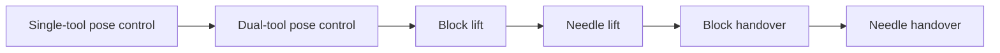

# DrAnmar Learning Path

The DrAnmar Learning Path begins with one deliberately small skill: move a
single PSM tool tip to a commanded pose. It promotes a policy only after
measured success is repeatable, then adds coordination and physical contact in
controlled stages.



The versioned contract is
[`config/dranmar_learning_path.json`](../config/dranmar_learning_path.json).
Every task also has a stable `DrAnmar-*` Gym ID, so datasets, checkpoints, and
benchmark evidence do not depend on an inherited task name.

## First training target

Start with:

```text
DrAnmar-Reach-PSM-IK-Rel-v0
```

This stage is small enough to expose infrastructure and reward defects quickly:

- one PSM and one stable target per episode;
- bounded relative Cartesian actions;
- direct target-relative position and axis-angle orientation in the policy
  observation;
- normalized actor and critic observations;
- bounded coarse and fine pose rewards;
- an explicit position-and-orientation success envelope;
- immediate episode completion on success; and
- direct success measurement from Isaac Lab's `success` termination tensor.

It is a control qualification task, not a surgical-skill claim.

## Efficient training contract

Stages 1 and 2 do not spend PPO samples rediscovering relative Cartesian
controllers already encoded by the action space. Stage 1 uses one analytic
relative-IK base and Stage 2 uses one base controller per PSM. Their residual
networks start at zero, so the first frozen policies reproduce the controllers
exactly. PPO is reserved for bounded single-arm corrections or dual-arm
coordination residuals only when deterministic held-out evaluation misses the
stage gate.

The Stage 2 dual policy observes position and axis-angle orientation error for
both tool tips. Its 12-dimensional action is assembled from two independent
six-dimensional controller outputs before the learned coordination residual is
applied. A versioned 0.25 dual-loop gain bounds the physical IK delta after
action clipping. The observation offsets, controller scales, initialization
method, held-out seeds, and promotion threshold are versioned in the
learning-path contract.

Stage 2 is deliberately collision-disabled free-space control qualification.
It proves simultaneous two-tool kinematics without allowing collision impulses
to contaminate the controller measurement. It does not establish collision
avoidance or contact competence. Stage 3 turns contact back on and requires
measured contact, stability, force, slip, and drop evidence.

Stage 3 uses an analytic approach-grasp-lift base with a bounded learned
residual. The block begins at a collision-clear 15 mm root height, the
commanded target is 8 cm, and success
requires the object to remain above 6 cm for ten consecutive 50 Hz control
steps. Every one of those steps must also satisfy bilateral PhysX contact,
goal-pose, object-speed, and force-termination constraints. This 0.2-second
dwell prevents a single contact impulse or initial-state coincidence from
being counted as a lift. The force limits are versioned simulator research
envelopes, not clinically calibrated tissue limits.

Stage 3 preserves orientation qualification; the corrected identity
quaternion makes that contract physically possible at reset. Its analytic base
approaches from 20 mm above the block's contact-calibrated grasp frame and
closes within 5 mm of that waypoint. A parallel 1,200-environment Isaac
Lab sweep compared six offsets from the same reset distribution and counted
only the first terminal outcome per world. It selected
`(0.0, 0.0, -0.0014)` metres from the authored root: 167 of its 200 assigned
worlds reached strict success, tied for the best measured rate while producing
the lowest mean object angular speed. The closed-mesh volume centroid was
rejected because the PSM tool-tip frame is not the jaw collision center;
commanding that centroid eliminated completed lifts.
Two subsequent shared-distribution 1,200-environment sweeps isolated jaw
closure timing. A 5 mm close radius achieved 185 of 200 strict successes on
each of two disjoint world shards; the fine sweep found a stable 4.6–5.0 mm
plateau, while 5.4 mm fell to 45 of 200. The controller therefore uses the
repeatable 5 mm boundary and requires a full-world evaluation before promotion.
Two lateral-alignment sweeps then found a repeatable 4.75–5.5 mm plateau and
selected its 5 mm center; both tighter 4.5 mm and wider 5.75 mm transitions
collapsed below 40% on their assigned shards.
Cartesian commands are capped at 0.1 during the final 20 mm approach. During
bilateral-contact carry, lateral translation remains capped at 0.1 while
vertical recovery is capped at 0.18, corresponding to at most 1.0 mm lateral
and 1.8 mm vertical per 50 Hz command. A full-population 1,200-environment
first-outcome sweep measured 997 strict successes at the 0.18 vertical limit,
up from 870 at 0.1, with no hard termination. The maximum observed object
contact force was 2.70 N: above the versioned 1 N soft penalty but below the
unchanged 5 N hard termination, so held-out force evidence is still required.
The carry controller also exposes a bounded vertical target-offset challenger.
Its versioned default remains zero until a complete 1,200-world first-outcome
comparison earns promotion; the actual 8 cm goal, 15 mm pose tolerance,
ten-step dwell, and force terminations remain unchanged during that comparison.
The controller lifts vertically until the object is within 40 mm of target
height before allowing simultaneous lateral goal tracking. A full-population
1,200-environment first-outcome sweep measured 1,023 strict successes at this
clearance, up from 997 at 20 mm, with no hard termination. Once physics-owned
object height rises above 18 mm, carry and gripper closure remain latched until
the object drops below that threshold, preventing contact-sensor flicker from
restarting the approach phase. Held-out play evidence separately records the
longest consecutive bilateral jaw-contact loss after the object rose above
30 mm, with 2-, 5-, and 10-control-step cohorts split by terminal success and
failure. This retention diagnostic never contributes reward or success credit;
it distinguishes transient contact-manifold flicker from mid-air slips that
would otherwise appear only as timeouts. Stage 4 requires its own
contact-calibrated needle grasp frame before promotion. Its primary
achievement is physical needle pickup: both native jaw contacts must exceed
0.01 N while the needle root remains above 6 cm for ten consecutive 50 Hz
control steps. This short dwell rejects a one-frame collision spike; it does
not require the needle to settle at an arbitrary commanded pose. The unchanged
5 N object-force and 2 N protected-surface hard terminations still veto
success. Goal position, orientation, and motion stability remain recorded as
transport-quality diagnostics for physical handover, but they do not gate
needle-pickup completion or contribute goal-tracking reward in Stage 4.
The composed-needle arc fraction `0.40` is the current pickup-qualified grasp
frame. It produced 1,101 of 1,200 sustained pickups on seed 17 and 1,127 of
1,200 on held-out seed 2361, with zero hard failures in both populations. The
combined 2,228/2,400 rate is 92.83%; the maximum measured needle force was
0.99 N and no protected-surface force was observed.

Stage 6 certifies physical ownership transfer rather than final
precision-placement quality. At reset, the tool tip with the shorter physical
path to the needle is latched as the giver; the other arm is the receiver.
The giver must establish native bilateral needle contact in at least three of
five control steps and lift the needle at least 10 mm above its episode-start
support height. The receiver must then establish its own three-of-five
bilateral contact window while the giver still owns the needle. The giver
releases, and the receiver retains the elevated needle for ten 50 Hz control
steps (0.2 seconds). One missing receiver-contact frame is allowed only when
the needle remains elevated and preserves the receiver-relative acquisition
offset. While native bilateral receiver contact remains present, that physical
contact is sufficient; needle-center motion within the closed jaws is not a
failure. Commanded closure cannot advance a phase without native filtered
contact. A drop, premature giver release, receiver loss during retention, 5 N
needle-force violation, 2 N unintended contact violation, or timeout is
failure.

Final target position, needle orientation, post-handover retreat, predefined
arc regions, jaw-retreat distance, long dual-grasp dwell, perfect RCM motion,
and zero incidental sub-limit contact are not Stage 6 success requirements.
They remain diagnostics and later curriculum objectives. A receiver recovery
pose is likewise diagnostic only.

The analytic seed controller executes the task in three explicit physical
segments: the closer arm picks up the needle, transports it into the shared
workspace while the receiver remains still, and presents it for acquisition.
Once the receiver acquires the needle, the giver opens without retreating
until native giver contact is gone, while the receiver freezes its wrist
position and orientation to avoid pulling or twisting the grasp during
release. Release is recognized
only when the giver is commanded open and its native contact is physically
gone, so a thin-needle contact flicker cannot start the retention clock early.
The receiver waits
during pickup and transport; it approaches only after the giver reaches
the shared presentation point. The two PSM roots are 10 cm apart; the current
seed moves the needle 3.5 cm from the giver toward the receiver, keeping both
instruments inside comfortable reach. Reaching that authored exchange point
organizes the demonstration but is not part of the success predicate.
The giver reuses the pickup-qualified Stage 4 carry limits and begins lifting
on current native bilateral contact rather than waiting for the three-of-five
phase window to finish.

The PSM foundation profile owns the physical jaw contract: a 0.07 radian
symmetric close target and 0.15 N·m actuator effort limit. Physical-parameter
challengers cannot be sharded within one replicated PhysX scene, so the sweep
runner requires one repeated value across all 1,200 environments and records
the applied environment override. Close-target or effort promotion must improve
the unchanged first-terminal success gate without increasing hard force
terminations. The 0.15 N·m effort setting achieved 4,379 strict successes in
4,800 first episodes across seed 17 and held-out seeds 2361, 4099, and 7919.
All four source-locked populations exceeded 90%, with zero hard termination and
a maximum measured object-contact force of 3.67 N below the unchanged 5 N
limit. This qualifies block lifting in simulation; other PSM task families
still require their own regression evidence. These simulator parameters are
not clinically calibrated jaw forces.

Stage 3 residual PPO cannot modify the proven approach, gripper, or orientation
commands. It receives only a bounded `(x, y, z)` correction after physics-owned
contact or lifted-object height has latched carry mode. The residual action
limit is `0.03`; its Gaussian exploration standard deviation is fixed at
`0.01`, and samples are applied only to carry translation. This preserves the
analytic approach, wrist orientation, and binary gripper during both training
and serving while allowing PPO to reduce transport timeouts.

Long visual diagnostics are written in bounded video chunks so recording does
not retain an entire multi-episode rollout in RAM. Single-environment evidence
records each episode's inclusive start and terminal frames plus its physics
termination outcome. This allows strict timeout and hard-failure clips to be
cut from the original recording without relabeling episodes by visual judgment.

Isaac Lab frontier asset rotations use `(x, y, z, w)` quaternion order. Lift
objects therefore use the explicit identity `(0, 0, 0, 1)`. This prevents the
legacy `(w, x, y, z)` identity from becoming a 180-degree X rotation, which
would create a π-radian goal error before the first action. In that identity
orientation, the composed and scaled block collision mesh reaches 14.613 mm
below its root; a 15 mm root height clears the approximately 0.2 mm table top.
The needle begins at a collision-clear 1 mm support height based on its scaled
mesh bounds.

The shared RSL-RL configuration uses separate actor and critic models, action
clipping, numerical checks, observation normalization, compact ELU networks,
adaptive-KL PPO, and task-specific rollout lengths. PhysX scenes use Fabric
cloning, visual markers are disabled during headless training, and target
commands do not resample partway through an episode.

The qualified Gilgamesh RTX 4090 training count is 1,200 environments. Use it
directly for the current learning path:

```bash
DR_ANMAR_TRUST_REQUESTED_NUM_ENVS=1 \
./dr_anmar_learning.sh train \
  DrAnmar-Reach-PSM-IK-Rel-v0 \
  1200
```

The override is explicit because the general launcher retains conservative
live-memory fitting for unknown machines and concurrent workloads. Evidence
records both the requested/actual count and whether the qualified-count
override was used.

The launcher requires at least 1,024 MiB of free GPU memory and 4,096 MiB of
available system RAM by default. It measures both resources immediately before
launch and caps parallel worlds from 8 up to 1,024 using the stricter live
allowance. The requested count remains in the evidence bundle alongside the
actual fitted count, total and available RAM, free VRAM, process peak memory,
and Torch peak GPU allocation.

Kit startup shares Torch's active CUDA context to avoid allocating a redundant
primary context while other GPU services are active. PhysX scene creation then
uses its own thread-safe context. Together with Fabric cloning, this lets
training survive a busy workstation and scale back up when memory becomes
available without silently falling back to CPU.

Override `DR_ANMAR_MIN_FREE_GPU_MIB` or
`DR_ANMAR_MIN_AVAILABLE_SYSTEM_MIB` only for a deliberately qualified lower
memory configuration. Set `DR_ANMAR_TRUST_REQUESTED_NUM_ENVS=1` only for an
environment count already qualified on the exact machine and task family.

## Commands

Configure the active Linux runtime when it is not in the default DrAnmar
workstation location:

```bash
export DR_ANMAR_ISAACLAB_ROOT=/absolute/path/to/IsaacLab
export DR_ANMAR_ISAAC_PYTHON=/absolute/path/to/isaac-python
export OMNI_KIT_ACCEPT_EULA=YES
```

Set the EULA variable only after accepting NVIDIA's license terms.

Then:

```bash
# Pure source and contract validation
./dr_anmar_learning.sh validate

# Confirm frontier runtime registration
./dr_anmar_learning.sh list

# Inspect native observation/action shapes, initial geometry, contacts, and
# termination terms before spending samples on a new task
DR_ANMAR_TRUST_REQUESTED_NUM_ENVS=1 \
./dr_anmar_learning.sh probe \
  DrAnmar-Lift-Block-PSM-IK-Rel-v0 \
  1200 10 \
  output/dranmar-learning/probe/lift-block-psm-1200-v1

# Create one native environment and complete one PPO iteration
./dr_anmar_learning.sh smoke

# Measure ten iterations without claiming convergence
./dr_anmar_learning.sh benchmark

# Initialize and validate the analytic-base residual Stage 1 policy
./dr_anmar_learning.sh pretrain

# Initialize and validate Stage 2 at the qualified count
DR_ANMAR_TRUST_REQUESTED_NUM_ENVS=1 \
./dr_anmar_learning.sh pretrain \
  DrAnmar-Reach-Dual-PSM-IK-Rel-v0 \
  1200 32 500 \
  output/dranmar-learning/pretrain/reach-dual-psm-1200-v1

# PPO refinement when deterministic held-out evaluation still misses its gate
./dr_anmar_learning.sh train

# Evaluate a frozen checkpoint
./dr_anmar_learning.sh play /absolute/path/to/model.pt
```

The benchmark and play commands emit typed runtime, learning, hardware, version,
resource, and success bundles under `output/dranmar-learning/`. They are the
primary experiment records; console output alone is not evidence.

Play qualification counts exactly the first terminal outcome from every
parallel environment. Environments that succeed early may reset and contribute
to diagnostic all-episode totals, but those later episodes cannot increase the
promotion success rate. Lift evidence also classifies every first episode by
the last achieved physical stage: bilateral contact, minimum height, goal
position, instantaneous qualified state, or sustained dwell. Target-distance
strata distinguish controller limitations from an unfavorable reset mix.

## Promotion gates

Each stage has an explicit success threshold and must pass all held-out seeds in
the manifest. Promotion requires:

1. a frozen checkpoint and cryptographic hash;
2. the task ID, source revision, runtime versions, GPU, seed, and environment
   count;
3. seeded play bundles for every held-out seed, using one first terminal
   outcome per environment;
4. success rate and stage-stratified failure distribution, not reward alone;
5. contact and force qualification for lift and handover; and
6. a fresh benchmark if the robot, asset, physics, reward, observation, or
   runtime contract changes.

Early stopping counts completed and successful episodes directly from Isaac
Lab's termination manager. It reduces wasted compute after the exact episode
success rate has remained above its threshold for the declared window. It does
not replace held-out evaluation.

## Evidence boundary

The Learning Path establishes reproducible simulator training and evaluation
contracts. Reach completion establishes pose-control performance in the named
simulation. Lift and handover completion additionally require simulator-owned
bilateral contacts, stable object motion, bounded force, and release/ownership
transitions.

These results are not clinical validation, physics calibration, a medical
device approval, or permission to control physical surgical hardware or provide
patient care.
