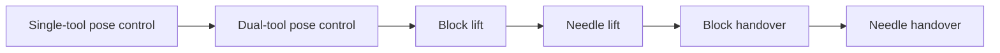

# DrAnmar Learning Path

The DrAnmar Learning Path begins with one deliberately small skill: move a
single PSM tool tip to a commanded pose. It promotes a policy only after
measured success is repeatable, then adds coordination and physical contact in
controlled stages.



The versioned contract is
[`config/dranmar_learning_path.json`](../config/dranmar_learning_path.json).
Every task also has a stable `DrAnmar-*` Gym ID, so datasets, checkpoints, and
benchmark evidence do not depend on an inherited task name.

## First training target

Start with:

```text
DrAnmar-Reach-PSM-IK-Rel-v0
```

This stage is small enough to expose infrastructure and reward defects quickly:

- one PSM and one stable target per episode;
- bounded relative Cartesian actions;
- direct target-relative position in the policy observation;
- normalized actor and critic observations;
- bounded coarse and fine pose rewards;
- an explicit position-and-orientation success envelope;
- immediate episode completion on success; and
- sticky per-episode success reporting at `Metrics/success_rate`.

It is a control qualification task, not a surgical-skill claim.

## Efficient training contract

The shared RSL-RL configuration uses separate actor and critic models, action
clipping, numerical checks, observation normalization, compact ELU networks,
adaptive-KL PPO, and task-specific rollout lengths. PhysX scenes use Fabric
cloning, visual markers are disabled during headless training, and target
commands do not resample partway through an episode.

The qualified Gilgamesh RTX 4090 training count is 1,200 environments. Use it
directly for the current learning path:

```bash
DR_ANMAR_TRUST_REQUESTED_NUM_ENVS=1 \
./dr_anmar_learning.sh train \
  DrAnmar-Reach-PSM-IK-Rel-v0 \
  1200
```

The override is explicit because the general launcher retains conservative
live-memory fitting for unknown machines and concurrent workloads. Evidence
records both the requested/actual count and whether the qualified-count
override was used.

The launcher requires at least 1,024 MiB of free GPU memory and 4,096 MiB of
available system RAM by default. It measures both resources immediately before
launch and caps parallel worlds from 8 up to 1,024 using the stricter live
allowance. The requested count remains in the evidence bundle alongside the
actual fitted count, total and available RAM, free VRAM, process peak memory,
and Torch peak GPU allocation.

Kit startup shares Torch's active CUDA context to avoid allocating a redundant
primary context while other GPU services are active. PhysX scene creation then
uses its own thread-safe context. Together with Fabric cloning, this lets
training survive a busy workstation and scale back up when memory becomes
available without silently falling back to CPU.

Override `DR_ANMAR_MIN_FREE_GPU_MIB` or
`DR_ANMAR_MIN_AVAILABLE_SYSTEM_MIB` only for a deliberately qualified lower
memory configuration. Set `DR_ANMAR_TRUST_REQUESTED_NUM_ENVS=1` only for an
environment count already qualified on the exact machine and task family.

## Commands

Configure the active Linux runtime when it is not in the default DrAnmar
workstation location:

```bash
export DR_ANMAR_ISAACLAB_ROOT=/absolute/path/to/IsaacLab
export DR_ANMAR_ISAAC_PYTHON=/absolute/path/to/isaac-python
export OMNI_KIT_ACCEPT_EULA=YES
```

Set the EULA variable only after accepting NVIDIA's license terms.

Then:

```bash
# Pure source and contract validation
./dr_anmar_learning.sh validate

# Confirm frontier runtime registration
./dr_anmar_learning.sh list

# Create one native environment and complete one PPO iteration
./dr_anmar_learning.sh smoke

# Measure ten iterations without claiming convergence
./dr_anmar_learning.sh benchmark

# Train with success-based early stopping
./dr_anmar_learning.sh train

# Evaluate a frozen checkpoint
./dr_anmar_learning.sh play /absolute/path/to/model.pt
```

The benchmark and play commands emit typed runtime, learning, hardware, version,
resource, and success bundles under `output/dranmar-learning/`. They are the
primary experiment records; console output alone is not evidence.

## Promotion gates

Each stage has an explicit success threshold and must pass all held-out seeds in
the manifest. Promotion requires:

1. a frozen checkpoint and cryptographic hash;
2. the task ID, source revision, runtime versions, GPU, seed, and environment
   count;
3. seeded play bundles for every held-out seed;
4. success rate and failure distribution, not reward alone;
5. contact and force qualification for lift and handover; and
6. a fresh benchmark if the robot, asset, physics, reward, observation, or
   runtime contract changes.

Early stopping reduces wasted compute after the success metric has remained
above its threshold for the declared window. It does not replace held-out
evaluation.

## Evidence boundary

The Learning Path establishes reproducible simulator training and evaluation
contracts. Reach completion establishes pose-control performance in the named
simulation. Lift and handover completion additionally require simulator-owned
bilateral contacts, stable object motion, bounded force, and release/ownership
transitions.

These results are not clinical validation, physics calibration, a medical
device approval, or permission to control physical surgical hardware or provide
patient care.
