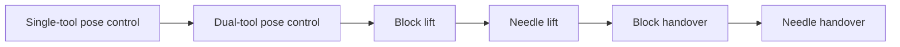

# DrAnmar Learning Path

The DrAnmar Learning Path begins with one deliberately small skill: move a
single PSM tool tip to a commanded pose. It promotes a policy only after
measured success is repeatable, then adds coordination and physical contact in
controlled stages.



The versioned contract is
[`config/dranmar_learning_path.json`](../config/dranmar_learning_path.json).
Every task also has a stable `DrAnmar-*` Gym ID, so datasets, checkpoints, and
benchmark evidence do not depend on an inherited task name.

## First training target

Start with:

```text
DrAnmar-Reach-PSM-IK-Rel-v0
```

This stage is small enough to expose infrastructure and reward defects quickly:

- one PSM and one stable target per episode;
- bounded relative Cartesian actions;
- direct target-relative position and axis-angle orientation in the policy
  observation;
- normalized actor and critic observations;
- bounded coarse and fine pose rewards;
- an explicit position-and-orientation success envelope;
- immediate episode completion on success; and
- direct success measurement from Isaac Lab's `success` termination tensor.

It is a control qualification task, not a surgical-skill claim.

## Efficient training contract

Stages 1 and 2 do not spend PPO samples rediscovering relative Cartesian
controllers already encoded by the action space. Stage 1 uses one analytic
relative-IK base and Stage 2 uses one base controller per PSM. Their residual
networks start at zero, so the first frozen policies reproduce the controllers
exactly. PPO is reserved for bounded single-arm corrections or dual-arm
coordination residuals only when deterministic held-out evaluation misses the
stage gate.

The Stage 2 dual policy observes position and axis-angle orientation error for
both tool tips. Its 12-dimensional action is assembled from two independent
six-dimensional controller outputs before the learned coordination residual is
applied. A versioned 0.25 dual-loop gain bounds the physical IK delta after
action clipping. The observation offsets, controller scales, initialization
method, held-out seeds, and promotion threshold are versioned in the
learning-path contract.

Stage 2 is deliberately collision-disabled free-space control qualification.
It proves simultaneous two-tool kinematics without allowing collision impulses
to contaminate the controller measurement. It does not establish collision
avoidance or contact competence. Stage 3 turns contact back on and requires
measured contact, stability, force, slip, and drop evidence.

Stage 3 uses an analytic approach-grasp-lift base with a bounded learned
residual. The block begins at a collision-clear 15 mm root height, the
commanded target is 8 cm, and success
requires the object to remain above 6 cm for ten consecutive 50 Hz control
steps. Every one of those steps must also satisfy bilateral PhysX contact,
goal-pose, object-speed, and force-termination constraints. This 0.2-second
dwell prevents a single contact impulse or initial-state coincidence from
being counted as a lift. The force limits are versioned simulator research
envelopes, not clinically calibrated tissue limits.

Stage 3 preserves orientation qualification; the corrected identity
quaternion makes that contract physically possible at reset. Its analytic base
approaches from 20 mm above the object, targets the object root as the grasp
frame, and closes only within 3 mm of that grasp waypoint. Cartesian
commands are capped at 0.1 during the final 20 mm approach and throughout
bilateral-contact carry, limiting each 50 Hz command to 1 mm. Carry lifts
vertically until the object is within 20 mm of target height before allowing
lateral goal tracking. This avoids striking the object root before the jaws
establish contact and prevents lateral carry from stripping a low-clearance
grasp. Stage 4 reuses the same orientation-qualified contract for needle
lifting.

Isaac Lab frontier asset rotations use `(x, y, z, w)` quaternion order. Lift
objects therefore use the explicit identity `(0, 0, 0, 1)`. This prevents the
legacy `(w, x, y, z)` identity from becoming a 180-degree X rotation, which
would create a π-radian goal error before the first action. In that identity
orientation, the composed and scaled block collision mesh reaches 14.613 mm
below its root; a 15 mm root height clears the approximately 0.2 mm table top.
The needle begins at a collision-clear 1 mm support height based on its scaled
mesh bounds.

The shared RSL-RL configuration uses separate actor and critic models, action
clipping, numerical checks, observation normalization, compact ELU networks,
adaptive-KL PPO, and task-specific rollout lengths. PhysX scenes use Fabric
cloning, visual markers are disabled during headless training, and target
commands do not resample partway through an episode.

The qualified Gilgamesh RTX 4090 training count is 1,200 environments. Use it
directly for the current learning path:

```bash
DR_ANMAR_TRUST_REQUESTED_NUM_ENVS=1 \
./dr_anmar_learning.sh train \
  DrAnmar-Reach-PSM-IK-Rel-v0 \
  1200
```

The override is explicit because the general launcher retains conservative
live-memory fitting for unknown machines and concurrent workloads. Evidence
records both the requested/actual count and whether the qualified-count
override was used.

The launcher requires at least 1,024 MiB of free GPU memory and 4,096 MiB of
available system RAM by default. It measures both resources immediately before
launch and caps parallel worlds from 8 up to 1,024 using the stricter live
allowance. The requested count remains in the evidence bundle alongside the
actual fitted count, total and available RAM, free VRAM, process peak memory,
and Torch peak GPU allocation.

Kit startup shares Torch's active CUDA context to avoid allocating a redundant
primary context while other GPU services are active. PhysX scene creation then
uses its own thread-safe context. Together with Fabric cloning, this lets
training survive a busy workstation and scale back up when memory becomes
available without silently falling back to CPU.

Override `DR_ANMAR_MIN_FREE_GPU_MIB` or
`DR_ANMAR_MIN_AVAILABLE_SYSTEM_MIB` only for a deliberately qualified lower
memory configuration. Set `DR_ANMAR_TRUST_REQUESTED_NUM_ENVS=1` only for an
environment count already qualified on the exact machine and task family.

## Commands

Configure the active Linux runtime when it is not in the default DrAnmar
workstation location:

```bash
export DR_ANMAR_ISAACLAB_ROOT=/absolute/path/to/IsaacLab
export DR_ANMAR_ISAAC_PYTHON=/absolute/path/to/isaac-python
export OMNI_KIT_ACCEPT_EULA=YES
```

Set the EULA variable only after accepting NVIDIA's license terms.

Then:

```bash
# Pure source and contract validation
./dr_anmar_learning.sh validate

# Confirm frontier runtime registration
./dr_anmar_learning.sh list

# Inspect native observation/action shapes, initial geometry, contacts, and
# termination terms before spending samples on a new task
DR_ANMAR_TRUST_REQUESTED_NUM_ENVS=1 \
./dr_anmar_learning.sh probe \
  DrAnmar-Lift-Block-PSM-IK-Rel-v0 \
  1200 10 \
  output/dranmar-learning/probe/lift-block-psm-1200-v1

# Create one native environment and complete one PPO iteration
./dr_anmar_learning.sh smoke

# Measure ten iterations without claiming convergence
./dr_anmar_learning.sh benchmark

# Initialize and validate the analytic-base residual Stage 1 policy
./dr_anmar_learning.sh pretrain

# Initialize and validate Stage 2 at the qualified count
DR_ANMAR_TRUST_REQUESTED_NUM_ENVS=1 \
./dr_anmar_learning.sh pretrain \
  DrAnmar-Reach-Dual-PSM-IK-Rel-v0 \
  1200 32 500 \
  output/dranmar-learning/pretrain/reach-dual-psm-1200-v1

# PPO refinement when deterministic held-out evaluation still misses its gate
./dr_anmar_learning.sh train

# Evaluate a frozen checkpoint
./dr_anmar_learning.sh play /absolute/path/to/model.pt
```

The benchmark and play commands emit typed runtime, learning, hardware, version,
resource, and success bundles under `output/dranmar-learning/`. They are the
primary experiment records; console output alone is not evidence.

## Promotion gates

Each stage has an explicit success threshold and must pass all held-out seeds in
the manifest. Promotion requires:

1. a frozen checkpoint and cryptographic hash;
2. the task ID, source revision, runtime versions, GPU, seed, and environment
   count;
3. seeded play bundles for every held-out seed;
4. success rate and failure distribution, not reward alone;
5. contact and force qualification for lift and handover; and
6. a fresh benchmark if the robot, asset, physics, reward, observation, or
   runtime contract changes.

Early stopping counts completed and successful episodes directly from Isaac
Lab's termination manager. It reduces wasted compute after the exact episode
success rate has remained above its threshold for the declared window. It does
not replace held-out evaluation.

## Evidence boundary

The Learning Path establishes reproducible simulator training and evaluation
contracts. Reach completion establishes pose-control performance in the named
simulation. Lift and handover completion additionally require simulator-owned
bilateral contacts, stable object motion, bounded force, and release/ownership
transitions.

These results are not clinical validation, physics calibration, a medical
device approval, or permission to control physical surgical hardware or provide
patient care.
