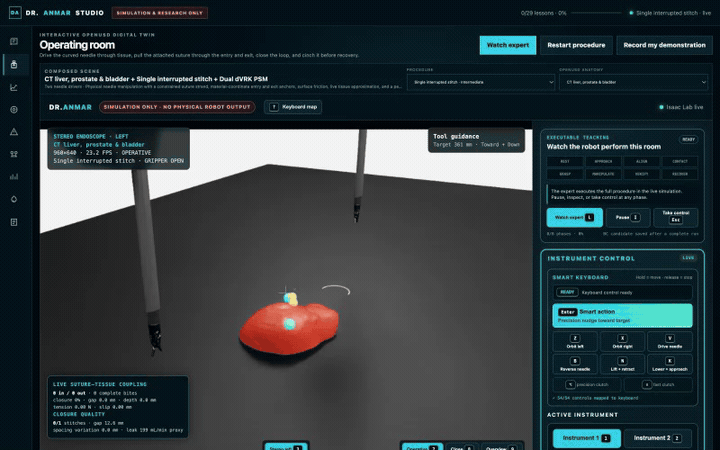

# Executable expert guidance

Dr.Anmar provides one live simulation expert controller across all 19 procedure rooms. It is an executable
teaching aid: the controller sends actions to the active Isaac environment while the OpenUSD room, operative
camera, grippers, procedure mechanics, phase annotations and safety telemetry continue updating. It is not a
prerecorded video and it is not a validated clinician policy.

## The eight-phase teaching loop

| Phase | What the doctor should inspect |
| --- | --- |
| **Rest** | Confirm the neutral pose, anatomy and operative camera. |
| **Approach** | Watch the open instrument move above the first target. |
| **Align** | Inspect depth, angle and working-axis alignment before contact. |
| **Contact** | Enter the interaction zone slowly while preserving the research safety envelope. |
| **Grasp** | Close deliberately and verify that the intended object or tissue follows. |
| **Manipulate** | Execute the room-specific path, handoff or tissue interaction. |
| **Verify** | Hold still while task, force, tissue and camera evidence are inspected. |
| **Recover** | Withdraw to a stable pose without undoing the completed work. |

The phase rail is always visible beside the operative view. The active phase is also shown in the outer
operating-room header, making the sequence readable in a demonstration or screen recording.

## Controls

| Action | Button | Keyboard |
| --- | --- | --- |
| Start or run again | **Watch expert** | `L` |
| Pause for inspection / resume | **Pause expert** / **Resume expert** | `I` |
| Take manual control at the current state | **Take control** | `Esc` |

Pause freezes the expert phase clock while the simulator remains available for inspection. Takeover preserves
the current simulator state and recording, records the intervention, and transfers authority to the doctor.

## Completion is not qualification

`8/8 phases` means the controller traversed the complete teaching state machine and saved the synchronized run.
It does **not** mean that the clinical task succeeded or that the trajectory is suitable for training. Dr.Anmar
keeps these decisions separate:

- `status=completed` records complete phase traversal;
- `clean_reference_eligible=true` requires a warning-free controller run;
- `behavior_cloning_reference_candidate=true` is set only for a clean uninterrupted simulation-expert run;
- `reference_review_status=pending_clinician_review` still requires human review before reference promotion;
- bounded target or waypoint timeouts keep the saved run available for debugging but prevent automatic
  Behavior Cloning reference qualification.

The user interface therefore distinguishes a completed teaching run from an approved expert reference.

## Live examples

### Interrupted suturing

  

The capture shows the active phase, dual-PSM operative view, suture/tissue panel, manual takeover, and keyboard
controls. The run completed 8/8 phases and saved 606 robot-state frames plus 62 camera frames. It remained
unqualified because align, contact and manipulation reached their bounded convergence timeouts.

### Dual-instrument needle handover

  

The capture shows both instruments entering the shared workspace and the live phase rail advancing through
manipulation and recovery. The run saved 687 robot-state frames plus 64 camera frames. Large approach, align and
contact residuals correctly prevented it from becoming a Behavior Cloning reference.

### Archived ultrasound-guided interface study

  

The capture shows separate probe and access-needle roles with confidence, needle visibility, target error and
protected-vessel clearance. The run saved 574 robot-state frames plus 53 camera frames. Align and contact
timeouts correctly kept it out of the reference set.

## Captured runtime evidence — 2026-07-21

| Procedure | State frames | Observed control rate | Phase result | Reference result |
| --- | ---: | ---: | --- | --- |
| Single interrupted stitch | 606 | 43.38 Hz | Completed 8/8 | Not eligible; 3 degraded reasons |
| Needle handover | 687 | 48.98 Hz | Completed 8/8 | Not eligible; 3 degraded reasons |
| Ultrasound-guided access | 574 | 49.54 Hz | Completed 8/8 | Not eligible; 2 degraded reasons |

These historical captures used the retired reduced-order prototype and are not evidence of native tissue,
thread, ultrasound or cutting physics. The current workstation will not launch those procedure families until
an Isaac Lab worker supplies their required native capabilities. Exact runtime provenance remains in each
generated demonstration manifest outside the public repository.

## Research data contract

Each run synchronizes the available members of this contract:

- robot actions, joint state, joint torque and tool/body poses;
- operative camera observations and timing;
- active procedure phase and event sequence;
- gripper, task object, native outcome and intervention state;
- needle, thread, tissue, cutting, vascular, ultrasound or recovery mechanics when active;
- physics-authority, calibration and clinical-validation boundaries;
- controller status, completed phases, warnings and reference-qualification state.

The GIFs are documentation captures only. Training and evaluation consume the checksummed NPZ/JSON
demonstration pair, never pixels extracted from the GIF.

## Remaining work

- Replace generic convergence targets with room-specific expert acquisition and manipulation plans.
- Achieve clean reference qualification for suturing, handover and ultrasound before clinician review.
- Exercise the other 15 rooms end to end, then repeat across the seven anatomy presets and challenge scenarios.
- Validate phase semantics, pause/takeover usability, task success, forces and teaching value with clinicians.
- Keep all generated references simulation-only until independent review and the relevant validation gates pass.
