# Dr.Anmar robotic-surgery learning direction

Status: adopted research direction

Scope: simulation, robot learning, evaluation, and research deployment
Machine-readable contract:
[`config/dranmar_rl_direction.json`](../config/dranmar_rl_direction.json)

## Executive decision

Dr.Anmar will not pursue a single end-to-end "autonomous surgeon" policy.
The program will build **bounded procedural autonomy**: medically defined
skills that are learned, stress-tested, recoverable, and composed behind
deterministic control and safety layers.

The program's primary optimization objective is **time to qualified task
achievement (TQTA)**:

```text
versioned task contract
→ first frozen checkpoint that passes held-out competence, safety, and recovery
```

TQTA is measured in wall-clock time and decomposed into GPU-hours, simulated
steps, successful expert-demonstration minutes, experiment count, and human
intervention time. A policy has not achieved the task merely because training
reward crossed a threshold or one seed produced a successful video.

The tracker binds the timer to the exact task-contract hash and consumes the
existing training and held-out evidence bundles:

```bash
python3 scripts/dr_anmar_tqta.py start \
  --task DrAnmar-Reach-PSM-IK-Rel-v0 \
  --tracker output/dranmar-learning/tqta/reach.json

python3 scripts/dr_anmar_tqta.py ingest \
  --tracker output/dranmar-learning/tqta/reach.json \
  output/dranmar-learning/train/dranmar_training_*.json \
  output/dranmar-learning/play/dranmar_play_*.json

python3 scripts/dr_anmar_tqta.py report \
  --tracker output/dranmar-learning/tqta/reach.json
```

The timer stops only when a single frozen checkpoint passes the task's declared
held-out seed count and minimum success rate. Re-ingesting an evidence file is
idempotent.

The learning strategy is:

1. use state-based PPO to qualify motor control and expose simulator defects;
2. use clinician demonstrations plus Isaac Lab Mimic and deformable-data
   generation to learn contact-rich skills;
3. compare recurrent behavior cloning, action-chunking transformers, and
   diffusion policies on the same frozen datasets;
4. use RL only for residual improvement, recovery, and robustness after a
   competent demonstration policy exists;
5. keep a deterministic controller, hard workspace/force constraints,
   runtime monitoring, and operator takeover outside the learned policy; and
6. promote policies on patient benefit, harm, recovery, and failure
   distributions rather than reward or trajectory completion alone.

This direction incorporates the practical lesson shared by the strongest
real-world surgical-autonomy results: learned policies are most credible when
combined with structured perception, relative task-space control, visual
servoing, planning, or formal constraints. Pure pixel-to-motor RL remains a
research lane, not the default deployment architecture.

## What the field actually supports

The evidence is promising but narrow:

- GPU-parallel surgical environments now cover reaching, lifting, handover,
  threading, dissection, retraction, and deformable manipulation.
- Simulation-trained policies have transferred to physical dVRK systems for
  bounded subtasks.
- A 2025 peer-reviewed system demonstrated seven game-based skills, five
  ex-vivo assistive tasks, and three in-vivo assistive tasks by combining
  learned policy components with visual parsing and visual servo control.
- Transformer and diffusion imitation policies improve action sequencing and
  tolerate multimodal demonstrations, but contact-rich surgical tasks remain
  difficult. SuFIA-BC found that contemporary behavior-cloning methods still
  struggled on its harder contact-rich tasks.
- Formal safety shielding, deformable demonstration generation, and surgical
  diffusion stabilization are fast-moving 2026 research directions, not
  clinically established components.
- Clinical autonomy remains much lower than research demonstrations suggest.
  Simulation success, ex-vivo success, and even animal-model results do not
  establish patient-care readiness.

## Adopted system architecture

```mermaid
flowchart LR
    A["Synchronized sensing<br/>stereo RGB-D, semantics,<br/>kinematics, force/contact"] -->
    B["State estimation<br/>uncertainty + observability"]
    B --> C["Procedure/skill graph<br/>bounded intent only"]
    C --> D["Local skill policy<br/>relative task-space actions"]
    D --> E["Safety shield<br/>workspace, force, no-go zones"]
    E --> F["Deterministic controller<br/>IK / impedance / servoing"]
    F --> G["Isaac/Newton/PhysX<br/>or research hardware"]
    G --> H["Outcome monitor<br/>benefit, harm, recovery"]
    H --> I{"Continue?"}
    I -->|"qualified"| C
    I -->|"uncertain or unsafe"| J["Abstain / neutral stop<br/>operator takeover"]
```



### Authority boundaries

- Learned perception may estimate scene state and uncertainty. It may not
  silently manufacture ground truth.
- A transformer, decision model, VLM, or VLA may propose the next bounded
  skill. It does not directly own high-rate tool motion.
- The local policy emits bounded relative task-space targets or short action
  chunks. Absolute joint commands are not the default surgical policy
  interface.
- The safety shield may modify or reject every learned action.
- Deterministic IK, impedance, servoing, and rate/acceleration limiting own the
  final actuator target.
- Post-physics contact and patient-state transitions remain authoritative for
  task outcomes in simulation.
- Runtime monitoring owns abstention, neutral stop, and takeover requests.

## Method portfolio

| Method | Dr.Anmar use | Decision |
| --- | --- | --- |
| RSL-RL PPO | Reach, dual-arm coordination, grasp approach, curriculum teachers | Primary state-policy baseline |
| Recurrent behavior cloning | Fast demonstration baseline and rescue-policy continuity | Always benchmark |
| ACT / action chunking | Precise multi-step manipulation with correlated motion | Primary visuomotor candidate |
| Diffusion policy | Multimodal demonstrations and bimanual dexterity | Primary visuomotor candidate |
| Diffusion Stabilizer Policy | Learning from perturbed or imperfect surgical demonstrations | Research candidate; reproduce before adoption |
| Residual RL | Improve a competent controller or imitation policy without relearning the whole behavior | Preferred use of RL on contact-rich skills |
| Offline RL | Learn from retained demonstrations and intervention data without unsafe online exploration | Research track after dataset quality gates |
| Goal-conditioned decision transformer | High-level cross-task sequencing | Planner candidate, not low-level authority |
| GR00T / pi-style VLA | Tool handling, OR assistance, and high-level skill proposals | Assistive lane only until precision and failure gates pass |
| Control Barrier Function shield | Enforce learned behavioral and spatial constraints | Required research direction for physical transfer |
| Classical planning / servoing | Geometry-grounded motions, re-entry, and deterministic fallback | Required comparator and fallback |

No algorithm is promoted because it is newer. Every candidate uses the same
dataset revision, observation contract, action interface, compute budget, and
held-out challenge suite.

## Learning tracks

### Track A — motor foundations

The current
[`DRANMAR_LEARNING_PATH.md`](DRANMAR_LEARNING_PATH.md) remains the first
implementation track:

```text
single PSM reach
→ dual PSM reach
→ block lift
→ needle lift
→ block handover
→ needle handover
```

This is infrastructure and control qualification. It is not a surgical
autonomy claim. PPO is appropriate here because observations are compact,
rewards can be made causal, and thousands of worlds can run in parallel.

### Track B — demonstrations and data quality

For each contact-rich skill:

1. record complete clinician or verified scripted demonstrations;
2. retain interventions and failures in a separate diagnostic partition;
3. reject missing, non-finite, desynchronized, or non-causal episodes;
4. annotate the fewest stable object-centric subtask boundaries needed by
   Isaac Lab Mimic;
5. generate spatial variants and replay them through the actual task success
   and harm monitors;
6. use SoftMimicGen-style generation for tissue, strand, and deformable
   manipulation only after the exact solver route is revision-bound; and
7. publish dataset cards with source, hashes, splits, sensors, action
   convention, success criteria, exclusions, and known biases.

Synthetic success labels must be recomputed from physics and outcome state.
Trajectory completion is not sufficient.

### Track C — visuomotor imitation bakeoff

Every serious surgical skill receives at least:

- a state-based recurrent BC baseline;
- a vision-based recurrent BC baseline;
- ACT with relative task-space action chunks; and
- a diffusion-policy baseline.

Where data contains recovery and perturbed demonstrations, a stabilization or
intervention-aware variant may be added. Evaluation includes task success,
time, path length, contact force, tissue damage, recovery, calibration,
inference latency, and action clipping.

### Track D — residual and constrained RL

RL begins from a controller, scripted expert, or imitation checkpoint. It is
used to improve robustness under uncertainty, reduce unnecessary motion, learn
recovery, or adapt force/contact behavior.

Rewards are separated from safety costs. Harm, overload, forbidden contact,
tool-tissue speed, loss of visibility, and physiological deterioration are not
tradeable shaping penalties; they are constraints and failure events.

### Track E — hierarchical procedure learning

Long procedures are represented as a skill graph with observable entry,
success, timeout, failure, and recovery conditions. A high-level learned model
may select among already-qualified skills, but may not bypass a skill's local
safety shield or promotion boundary.

The first procedure-level objective is not "finish the operation." It is:

```text
select the correct bounded intervention
→ execute or abstain
→ verify patient effect
→ recover or hand back
```

### Track F — sim-to-real and HIL

Physical transfer is staged:

1. frozen policy replay in a calibrated digital twin;
2. software-in-the-loop with deployment timing and transport;
3. hardware-in-the-loop with the real controller and sensors;
4. dry-lab phantom;
5. instrumented ex-vivo research;
6. only then, separately approved preclinical work.

Relative task-space actions, kinematic calibration, latency injection,
observation noise, friction/contact identification, camera perturbation, and
failure recovery are qualified independently. Zero-shot transfer is measured,
not assumed.

## Compute-efficiency policy

The program minimizes **time to qualified task achievement**, not raw simulator
FPS. Qualified learning progress per GPU-hour is the main diagnostic for
finding where TQTA is being lost.

- Use rigid proxies and privileged state for early debugging.
- Move to native deformables only after the policy can solve the rigid task.
- Distill privileged teachers into deployable sensor policies.
- Sweep environment count, rollout length, and camera count with short
  learning runs before committing long jobs.
- Keep rendering off for state-policy training; use tiled cameras for
  visuomotor batches.
- Use curriculum stages driven by failure modes, not episode count alone.
- Cache immutable datasets and precomputed visual features when the experiment
  permits it.
- Stop runs on non-finite state, simulator diagnostics, invalid contacts, or
  evidence-contract failure.
- Use multi-seed pruning for weak candidates and full held-out evaluation only
  for finalists.
- Mine counterexamples from failures and operator interventions; do not inflate
  the clean expert set with failed learned-policy rollouts.
- Warm-start every compatible task from a prior policy, scripted controller, or
  demonstration dataset instead of relearning generic reach and grasp.
- Race algorithm/configuration candidates under identical short budgets, then
  use successive halving: stop clear losers early and expand only the best
  learning curves.
- Measure time to competence during training, then remeasure time to the full
  qualification gate. Optimizing the former while ignoring robustness or
  recovery creates a false speedup.

### Fastest-path training loop

Each task follows the same time-boxed loop:

1. **Contract smoke** — verify reset, observations, actions, reward/cost,
   success, and failure on a tiny batch.
2. **Expert bootstrap** — collect the minimum clean demonstrations or generate
   a scripted/privileged teacher.
3. **Short race** — compare warm-start PPO, recurrent BC, and the task-relevant
   ACT/diffusion candidate with fixed compute and data.
4. **Successive halving** — retain candidates by held-out learning progress per
   wall-clock minute, not training reward alone.
5. **Targeted curriculum** — generate only the perturbations corresponding to
   observed failure clusters.
6. **Residual refinement** — use constrained residual RL when imitation or the
   controller is competent but brittle.
7. **Frozen qualification** — evaluate the exact checkpoint across held-out,
   stress, recovery, latency, and harm gates.
8. **Transfer forward** — register the qualified encoder, controller, skill
   policy, and failure corpus as starting assets for the next task.

The default experiment is deliberately small. Scale is earned by a positive
learning slope, valid simulator state, and a plausible path to the qualification
gate.

## Promotion gates

A policy advances only when all gates relevant to its scope pass:

1. **Contract** — observation/action units, frames, timing, reset, task
   semantics, and patient-effect authority are validated.
2. **Competence** — frozen checkpoint passes task-specific success thresholds
   across held-out seeds with confidence intervals.
3. **Physical behavior** — contact, force, slip, tissue response, release, and
   failure transitions are measured on the promoted solver route.
4. **Robustness** — calibrated perturbation strata and counterfactual initial
   states pass without hiding subgroup failures in one aggregate mean.
5. **Safety** — no hard constraint violations in the declared stress budget;
   the statistical limit of that evidence is reported.
6. **Recovery** — detection, abstention, neutral stop, re-entry, and operator
   takeover are exercised from injected failures.
7. **Efficiency** — latency, memory, GPU-hours, and throughput meet the target
   runtime budget.
8. **HIL/bench** — exact exported policy and controller pass timing, sensor,
   and physical-bench gates.
9. **Clinical boundary** — all claims remain limited to the simulator, phantom,
   ex-vivo, or approved study actually performed.

Reward is a training signal. It is never evidence by itself.

## NVIDIA stack allocation

| Layer | Adopted component |
| --- | --- |
| Scene and asset authority | OpenUSD |
| Stable simulation baseline | Isaac Sim + PhysX |
| Robot-learning environment | Isaac Lab manager-based environments |
| State-policy training | RSL-RL PPO |
| Demonstration augmentation | Isaac Lab Mimic |
| Imitation training | Robomimic plus Dr.Anmar ACT/diffusion candidates |
| Deformable frontier | Newton/Warp and measured Dr.Anmar solver integrations |
| Sensor and synthetic data | Isaac Sim cameras/Replicator and bounded Isaac for Healthcare components |
| Deployment research | ONNX/TensorRT and Holoscan/IGX after HIL qualification |
| Generative world models | Synthetic variation and non-authoritative evaluation only |

NVIDIA's Medical Physics Simulation and generative surgical simulators remain
watch-list components until their mechanics, failure behavior, provenance, and
policy-evaluation correlation are independently measured for a Dr.Anmar task.
Generated video never replaces solver-owned geometry, contact, force, tissue
state, patient effects, or safety evidence.

## Immediate execution order

1. Instrument the active PSM learning harness with TQTA, GPU-hours-to-gate,
   samples-to-gate, and expert-minutes-to-gate.
2. Finish and freeze the active PSM reach/lift/handover motor ladder.
3. Add a single canonical dataset schema shared by teleoperation, Isaac Lab
   Mimic, Robomimic, ACT, and diffusion policies.
4. Make needle lift repeatable without teleportation or hidden attachment.
5. Run the first successive-halving algorithm race on needle lift, then on
   physical handover.
6. Add safety costs, a shield interface, injected-failure recovery, and
   abstention before procedure-level composition.
7. Move the first qualified contact skill onto deformable tissue and measure
   patient-effect change.
8. Build HIL only after the exported-policy and runtime evidence contracts are
   stable.

## Primary research basis

- [ORBIT-Surgical: An Open-Simulation Framework for Learning Surgical Augmented Dexterity](https://arxiv.org/abs/2404.16027)
- [Isaac Lab: A GPU-Accelerated Simulation Framework for Multi-Modal Robot Learning](https://arxiv.org/abs/2511.04831)
- [SurRoL: An Open-source Reinforcement Learning Centered and dVRK Compatible Platform](https://arxiv.org/abs/2108.13035)
- [LapGym: An Open Source Framework for Reinforcement Learning in Robot-Assisted Laparoscopic Surgery](https://arxiv.org/abs/2302.09606)
- [Surgical embodied intelligence for generalized task autonomy](https://pubmed.ncbi.nlm.nih.gov/40668896/)
- [Sim-to-real visual RL for deformable surgical manipulation](https://arxiv.org/abs/2406.06092)
- [Surgical Robot Transformer](https://arxiv.org/abs/2407.12998)
- [SuFIA-BC](https://arxiv.org/abs/2504.14857)
- [Diffusion Stabilizer Policy](https://arxiv.org/abs/2503.01252)
- [SoftMimicGen](https://arxiv.org/abs/2603.25725)
- [Safety-guaranteed Surgical Policy](https://arxiv.org/abs/2603.07032)
- [Autonomous robotic laparoscopic surgery for intestinal anastomosis](https://pubmed.ncbi.nlm.nih.gov/35080901/)
- [Levels of autonomy in FDA-cleared surgical robots](https://pubmed.ncbi.nlm.nih.gov/38671232/)

## Evidence boundary

This is a research and engineering direction. It does not establish clinical
validity, medical-device status, physical calibration, patient-specific
accuracy, or suitability for patient care. No learned policy produced under
this program may control patient-care hardware without separate institutional,
regulatory, safety, and clinical authorization.
