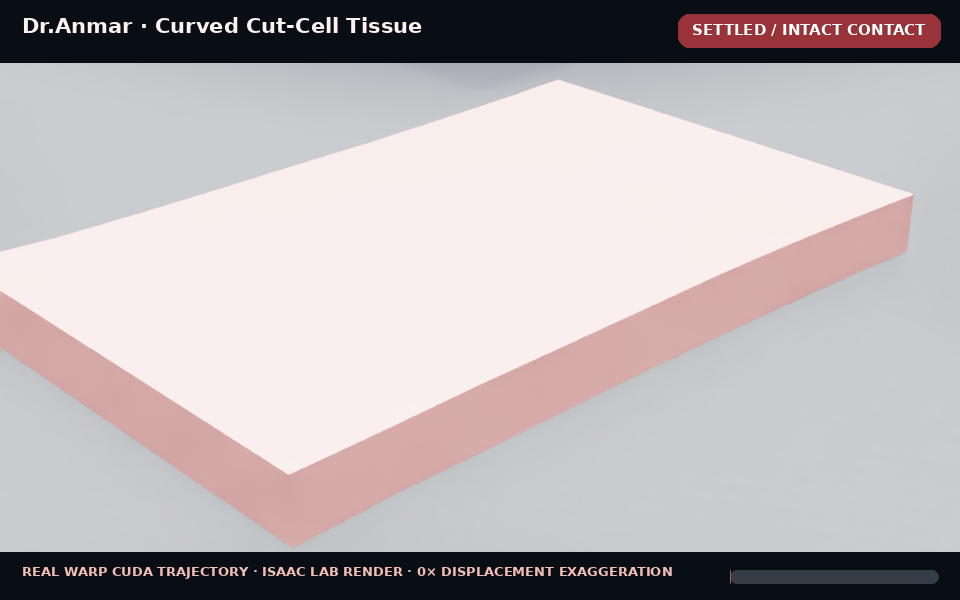

# DrAnmar cuttable-tissue development lane

This branch begins with the intact-contact prerequisite for arbitrary scalpel
cutting. It does not yet claim that tissue can be cut.

The CPU reference solver provides a deterministic Total-Lagrangian tetrahedral
coupon with compressible Neo-Hookean stress, one-term Prony relaxation,
pre-tensioned fixed boundary bands, and two-way contact against a finite rounded
scalpel edge. The qualification presses, holds, slides, and retracts that edge.
Fracture is explicitly disabled and fails closed.

Scalpel contact projects blade-attached edge samples into the current
piecewise-linear tissue surface, integrates an analytic rounded-edge contact
strip, and distributes force through triangle barycentric coordinates. An
off-grid sweep must retain contact across a complete mesh cell; node-only
collision is not accepted.

Run the reference qualification with:

```bash
python scripts/qualify_dranmar_cuttable_tissue.py \
  --output physics_next/receipts/cuttable-tissue-intact-contact-reference.json
```

The receipt gates finite state, element inversion, minimum Jacobian, anchor
drift, volume change, contact penetration, force relaxation, elastic recovery,
zero fracture events, and deterministic replay. It is simulator-engineering
evidence only; the parameters are not calibrated human-skin properties.

The next stage must preserve this receipt while replacing the CPU reference
with a GPU backend. `dr_anmar_cuttable_tissue_warp.py` now carries Warp kernels
for the same Neo-Hookean/Prony internal force and projected scalpel contact. Its
retained CPU-device parity receipt validates the kernel equations but leaves
CUDA promotion pending. Run it inside an isolated Warp/Isaac runtime with:

```bash
python scripts/dr_anmar_cuttable_tissue_warp.py --device cuda:0 \
  --output physics_next/receipts/cuttable-tissue-warp-cuda-parity.json
```

Only after CUDA parity and the full dynamic receipt pass should fracture be
enabled using a blade-seeded dynamic front, cohesive fracture work,
adhesion/wear, rate-dependent separation, and persistent two-sided collision
surfaces.

## Cohesive fracture reference

The next constitutive/topology oracle is now available:

```bash
python scripts/qualify_dranmar_cohesive_fracture.py
```

It assigns an eligible cohesive interface to every internal tetrahedral face,
rather than authoring a few permitted cut locations. A finite swept scalpel
edge may seed only interfaces connected to the top entry surface or the
existing cut front. Separation then follows an irreversible bilinear
mixed-mode law with fracture work, Benzeggagh–Kenane mode mixing, viscous rate
strengthening, and an independent compression response after complete failure.

The retained reference receipt qualifies all 1,000 internal interfaces, exact
deterministic replay, off-grid blade-entry coverage, Mode I/II/mixed-mode
energy closure, damage irreversibility, and post-failure compression. This is
not yet a dynamic cut: the intact FEM still fails closed while fracture is
enabled. The next runtime stage must give adjacent tetrahedra discontinuous
degrees of freedom, generate persistent two-sided collision surfaces, preserve
mass, and demonstrate mesh-refinement convergence on CUDA.

The cohesive law also has an independent Warp implementation. Its retained CPU
parity receipt covers intact loading, softening, mixed mode, rate strengthening,
unseeded overload, and post-failure compression:

```bash
python scripts/dr_anmar_cohesive_fracture_warp.py --device cuda:0 \
  --output physics_next/receipts/cuttable-tissue-cohesive-warp-cuda-parity.json
```

CPU parity is not CUDA qualification and does not enable runtime fracture.

The architecture follows the experimentally informed separation of bulk large
deformation, cohesive fracture, rate-dependent dissipation, adhesion/wear, and
tool contact described in [Moreno-Mateos and Steinmann
(2026)](https://doi.org/10.1038/s41524-025-01869-y). Parameters in this profile
remain provisional until matched to measurements from the exact tissue analog;
they must not be presented as human-skin or clinical validation.

## Persistent arbitrary topology

The cut-cell topology reference is qualified with:

```bash
python scripts/qualify_dranmar_persistent_cut_topology.py
```

The 48×32×12 field stores multiple oriented discontinuity patches per cell.
It does not delete voxels or remove tissue volume. Fracture work alone advances
damage; adhesion, wear, viscous dissipation, and Coulomb friction are retained
as separate auditable channels. This prevents a large friction impulse from
being mislabeled as material fracture.

Each fractured patch is clipped against its cell and reconstructed twice with
opposed normals. These paired zero-volume sheets are the persistent wound
surfaces and collision source for the later discontinuous FEM runtime. Multiple
patches in one cell permit curved and intersecting incisions; replaying an
existing incision is topology-idempotent.

The retained reference covers 18,432 field cells, nine arbitrary entry origins,
a curved incision, a repeated incision, and a crossing incision. It produced
72 intersection cells, exactly equal positive/negative wound area, zero removed
volume, complete wound-collision sampling, and deterministic replay. These are
topology/reference results—not yet proof that the dynamic FEM opens and collides
correctly under a robot-held scalpel.

## RTX 4090 CUDA qualification

The intact FEM/contact and cohesive-fracture Warp kernels were qualified on the
Gilgamesh RTX 4090 at source revision `b579897`. Both raw receipts report
`device_is_cuda: true`, no failed gates, and no pending CUDA promotion. The
same pinned checkout passed all 21 reference tests under Isaac's Python 3.11,
NumPy 1.26.4, and Warp 1.15.0.

Five fresh CUDA replays all qualified. Cohesive/contact metrics were identical;
parallel internal-force atomic accumulation varied by only `6.65e-9` relative
L2 across the five runs, versus the `5e-4` qualification limit. Hardware,
runtime, raw-receipt hashes, replay envelopes, and the evidence boundary are
frozen in `cuttable-tissue-cuda-promotion-lock.json`.

This promotes the existing kernels to CUDA-qualified simulator components. It
does not promote dynamic fracture: discontinuous FEM degrees of freedom and
deforming two-sided wound collision remain the next required runtime gate.

## Exact planar dynamic separation

The first live discontinuous-FEM reference is qualified with:

```bash
python scripts/qualify_dranmar_dynamic_planar_cut.py
```

Each tetrahedron owns independent nodal degrees of freedom while 1,000
cohesive interfaces maintain the intact continuum. After intact pre-tension
settles, 24 interfaces exactly coincident with the qualified plane are released.
Their two face copies then deform independently and become opposed one-sided
collision surfaces.

The retained run preserves mass and net momentum, has zero inversions with a
minimum Jacobian of 0.976, holds all remaining cohesive seams below 0.044 mm,
and relaxes to a 1.94 mm mean opening. Both wound sides stop an inward-moving
probe without surface crossing.

This is intentionally a planar, mesh-conforming dynamic gate. It does not map
the arbitrary cut-cell field onto mesh faces. Arbitrary curved and intersecting
dynamic cuts remain blocked until an embedded-discontinuity or cut-cell enriched
FEM formulation can consume the persistent field without mesh-direction bias.

The exact planar reference also replayed under Gilgamesh's Isaac Python runtime
with the same deterministic trace and 26/26 tests passing. Its runtime lock
explicitly records CPU execution and keeps CUDA dynamic cutting blocked; the
earlier CUDA promotion applies only to the continuum/contact/cohesive kernels.

## Curved embedded-discontinuity dynamics

The next reference removes the planar face-conformity restriction:

```bash
python scripts/qualify_dranmar_dynamic_curved_cut.py \
  --output physics_next/receipts/dynamic-curved-cut-reference.json
```

An implicit sinusoidal sheet cuts through tetrahedron interiors. Each crossed
edge is root-solved against the nonlinear level set, duplicated on the two
material sides, and shared across neighboring clipped faces. Deterministic
face triangulation keeps the sub-tetrahedralization conforming. No element is
deleted: the qualified remesh preserves volume and mass to machine precision.

The connected pre-tensioned coupon settles before its position, velocity, and
Prony stress history are interpolated into 1,760 cut-cell tetrahedra. The two
wound sides then evolve independently under the same finite-strain
Neo-Hookean/viscoelastic bulk law. Failed cohesive interfaces remain
traction-free in separation while retaining unilateral compression and damping,
so the wound cannot ghost through itself or numerically heal.

The retained local reference cuts 96 original tetrahedra, reconstructs 256
deforming wound triangles, and runs 4,000 explicit steps with zero inversions.
Both wound sides reject an inward-moving collision probe. Formation is gated by
the cohesive fracture-work ratio; a subcritical request fails closed.

This qualifies one curved, non-face-snapped dynamic discontinuity. Repeated and
intersecting cuts remain qualified in the persistent cut-cell topology layer,
but sequentially enriching an already split live FEM mesh is still blocked.
Likewise, this NumPy reference is not a CUDA dynamic solver, a calibrated model
of human skin, biomechanical validation, or clinical validation.

## Curved dynamics on Warp CUDA

The same remesh and initial state can be advanced entirely on Warp CUDA:

```bash
python scripts/dr_anmar_dynamic_curved_cut_warp.py --device cuda:0 \
  --output physics_next/receipts/dynamic-curved-cut-warp-cuda-reference.json
```

On Gilgamesh's RTX 4090, the bulk finite-strain force, Prony history update,
unilateral wound compression/damping, opening traction, and semi-implicit
integration all execute on `cuda:0`. The retained 4,000-step run reports zero
inversion observations, a 0.870 minimum Jacobian, 0.069 mm mean opening, and
complete two-sided wound collision with zero probe crossing.

Five fresh CUDA replays all qualified. Atomic force accumulation produced a
maximum Jacobian envelope only 1.2e-6 wide and a mean-gap envelope 1.1e-8 m
wide. The source, profile, CPU oracle, raw CUDA receipt, hardware/runtime, test
count, replay hashes, and metric envelopes are frozen in
`dynamic-curved-cut-cuda-promotion-lock.json`.

This promotes the single curved post-fracture dynamic path to CUDA-qualified
simulator engineering evidence. It does not yet promote a scalpel-driven moving
fracture front or sequential intersecting live remeshing, and it remains
uncalibrated against human-tissue specimens.

## Real rendered CUDA trajectory



This GIF is an Isaac Lab render of 64 positions sampled from the actual
4,000-step Warp `cuda:0` trajectory on Gilgamesh. The exterior surface and both
wound sheets are reconstructed from the qualified cut-cell nodes on every
frame. Displacement is shown at physical scale with no visual exaggeration or
generated intermediate imagery. The accompanying
`dranmar-cuttable-tissue-curved-cuda.json` receipt binds the GIF hash, renderer
revision, mesh sizes, CUDA device and evidence boundary.
